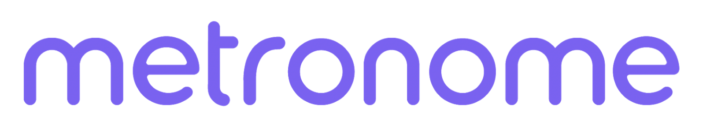
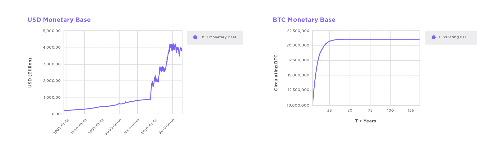
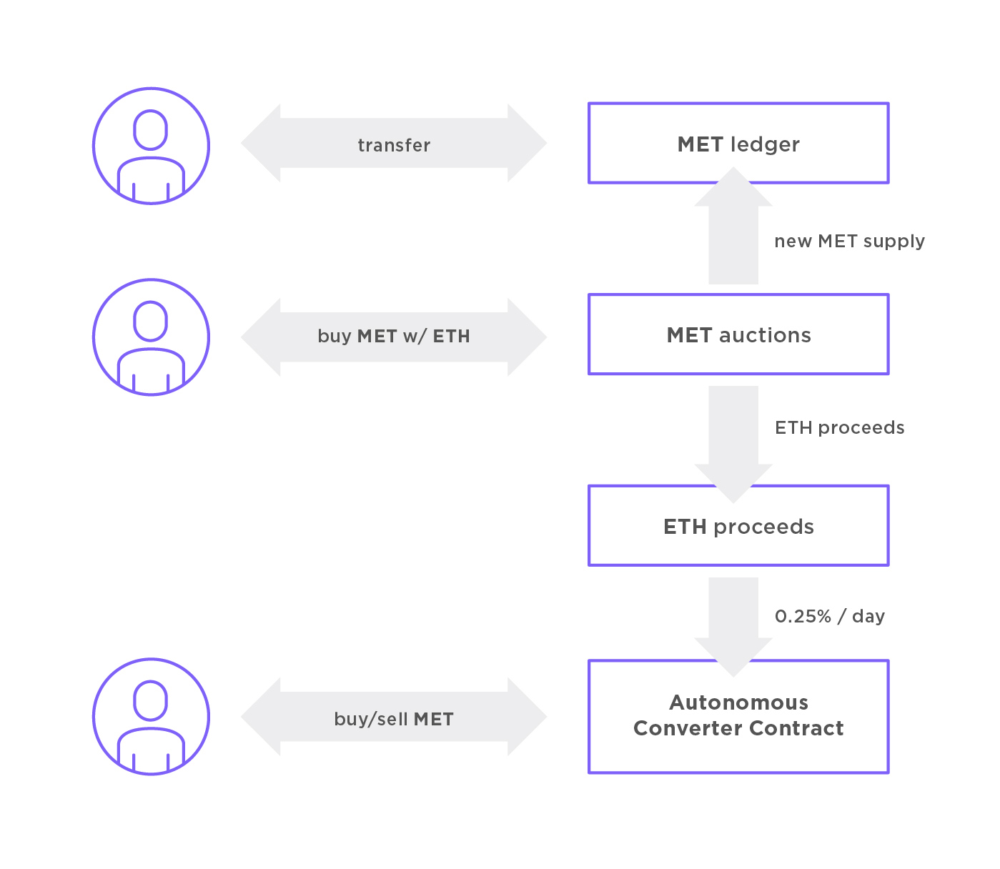
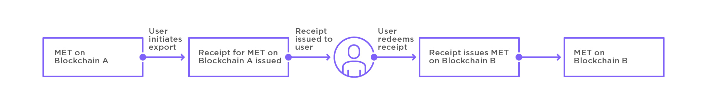
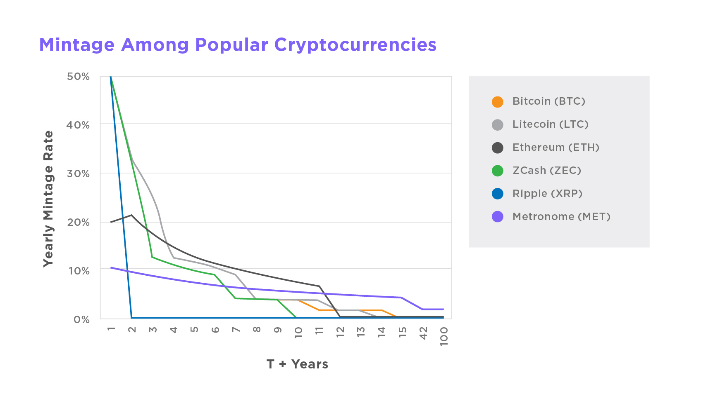
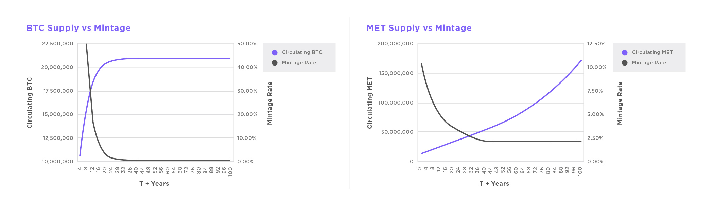
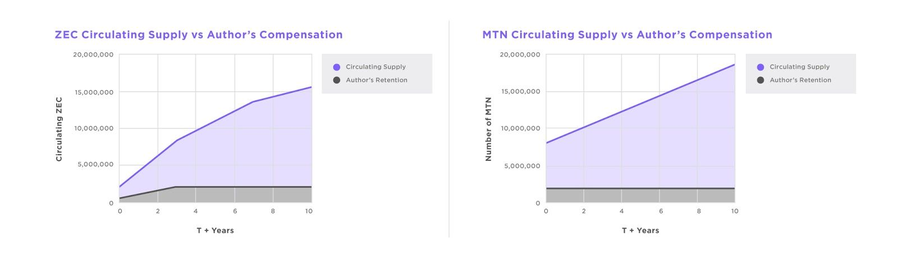
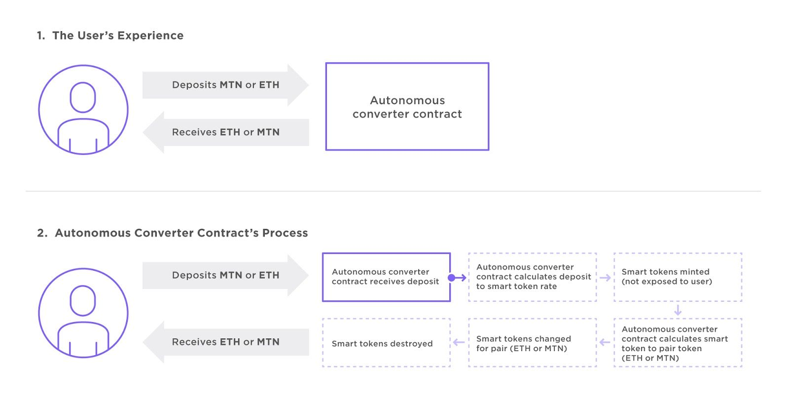

Version 0.9855 (Last Updated 05.21.2018)

**Notes:**

\(1) This draft Owner's Manual is a work in progress and describes the design and structure of Metronome, a new type of cryptocurrency. Metronome and its underlying technology is still in development and this Owner's Manual will be updated throughout this process to reflect changes  throughout the development cycle. While every measure has been taken to ensure the accuracy of the material, Metronome authors and their partners do not guarantee the accuracy or completeness of the material found in this Owner's Manual.

\(2) Potential purchasers of Metronome and participants in the Metronome ecosystem should read this Owner's Manual, including the acknowledgements and disclaimers in Appendix \[A\], and should carefully consider any risks before making a purchase.

**Owner's Manual License**

© 2018 Autonomous Software. All rights not expressly granted by Licensor
are hereby reserved.

AUTONOMOUS SOFTWARE ("LICENSOR") OWNS AND RETAINS EXCLUSIVE OWNERSHIP OF, AND ALL RIGHT, TITLE AND INTEREST IN AND TO, ALL COPYRIGHTS AND OTHER INTELLECTUAL PROPERTY RIGHTS IN AND TO THIS METRONOME OWNER'S MANUAL (THE "OWNER'S MANUAL") AND THE GENERICIZED VERSION (DEFINED BELOW). THE OWNER'S MANUAL AND GENERICIZED VERSION ARE COLLECTIVELY REFERRED TO HEREIN AS THE "WORK."

"METRONOME," "MET," AND THE METRONOME LOGO (COLLECTIVELY, THE "METRONOME MARKS") ARE TRADEMARKS OF LICENSOR AND MAY BE USED ONLY WITH LICENSOR'S EXPRESS WRITTEN PERMISSION. YOU MAY NOT USE THE METRONOME MARKS OR ANY CONFUSINGLY SIMILAR MARK ON OR IN CONNECTION WITH ANY PRODUCT OR SERVICE, OR IN ANY OTHER MANNER THAT MIGHT CAUSE CONFUSION IN THE MARKETPLACE, INCLUDING IN ADVERTISING, OR ON SOFTWARE OR HARDWARE.

1.  **License Grant and Restrictions.** Subject to the terms and
    conditions of this License, Licensor hereby grants you a worldwide,
    royalty-free, non-exclusive, perpetual license to copy, display and
    distribute the Owner's Manual in whole (but not in part) without
    modification, modify or create a derivative work of the Genericized
    Version (defined below), and copy, display and distribute such work;
    provided that none of the foregoing creates any implication that you
    are, or that your work or the cryptocurrency, smart contract or
    technology described therein is, in any way associated with or
    endorsed by Licensor or its affiliates. The above rights may be
    exercised in all media and formats whether now known or hereafter
    devised. The above rights include the right to make such
    modifications as are technically necessary to exercise the rights in
    other media and formats. Each time you distribute or publicly
    perform the Work, the Licensor grants to the recipient a license to
    the Work on the same terms and conditions as the license granted to
    you under this License. "Genericized Version" means a version of the
    Owner's Manual which does not include or contain any reference to
    Licensor, to Licensor's affiliates or to the words Metronome, MET,
    or any Metronome Marks.

2.  **Proposed Modifications to Owner's Manual.** By submitting any
    proposed modification to the Owner's Manual, you hereby assign to
    Licensor all copyrights without restriction in and to such proposed
    modification. As such, Licensor may choose in its sole discretion,
    to include or not to include any such proposed modification in the
    Owner's Manual (in whole or in part, and in modified or unmodified
    form).

3.  **Disclaimer of Representations and Warranties**. THE OWNER'S MANUAL     IS PROVIDED AS-IS WITH NO REPRESENTATIONS OR WARRANTIES OF ANY KIND, EXPRESS, IMPLIED, STATUTORY OR OTHERWISE, INCLUDING, WITHOUT LIMITATION, WARRANTIES OF TITLE, MERCHANTABILITY, FITNESS FOR A PARTICULAR PURPOSE, NON-INFRINGEMENT, ACCURACY, OR THE PRESENCE OR ABSENCE OF ERRORS. SOME JURISDICTIONS DO NOT ALLOW THE EXCLUSION OF    IMPLIED WARRANTIES, SO SUCH EXCLUSION MAY NOT APPLY TO YOU.

4.  **Enforceability**. If any provision of this License is invalid or     unenforceable under applicable law, it shall not affect the validity or enforceability of the remainder of the terms of this License, and without further action by the parties to this agreement, such provision shall be reformed to the minimum extent necessary to make such provision valid and enforceable. No term or provision of this License shall be deemed waived and no breach consented to unless such waiver or consent shall be in writing and signed by the party to be charged with such waiver or consent.

5.  **Treaty Rights**. The rights granted under, and the subject matter referenced, in this License were drafted utilizing the terminology of the Berne Convention for the Protection of Literary and Artistic Works (as amended on September 28, 1979), the Rome Convention of 1961, the WIPO Copyright Treaty of 1996, the WIPO Performances and Phonograms Treaty of 1996 and the Universal Copyright Convention (as revised on July 24, 1971). These rights and subject matter take effect in the relevant jurisdiction in which the License terms are sought to be enforced according to the corresponding provisions of the implementation of those treaty provisions in the applicable national law. If the standard suite of rights granted under applicable copyright law includes additional rights not granted under this License, such additional rights are deemed to be included in the License; this License is not intended to restrict the license of any rights under applicable law.

Table of contents
=================

**[Table of contents](#table-of-contents)**

**[List of Tables and Figures](#list-of-tables-and-figures)**

**[Motivations](#motivations)**

> [Taking cryptocurrency to the next level... literally](#taking-cryptocurrency-to-the-next-level-literally)

**[Executive Summary](#executive-summary)**

**[Background](#background)**

> [Blockchain technology](#blockchain-technology)
>
> [Cryptocurrency](#cryptocurrency)
>
> [Descending price auctions](#descending-price-auctions)

**[Introducing Metronome](#introducing-metronome)**

**[How Metronome Works](#how-metronome-works)**

> [Cross-Blockchain Portability](#cross-blockchain-portability)
>
> [Distributed, voluntary consensus > governance](#distributed-voluntary-consensus-governance)

**[Cryptocurrency market context to date](#cryptocurrency-market-context-to-date) **

> [The landscape](#the-landscape)

**[Metronome contracts and technical aspects](#metronome-contracts-and-technical-aspects)**

**[Metronome Proceeds and Autonomous Converter Contracts](#metronome-proceeds-and-autonomous-converter-contracts)**

**[Token Supply Economics](#token-supply-economics)**

> [Theory](#theory)
>
> [Supply schedule](#supply-schedule)
>
> [Metronome Core](#metronome-core)
>
> [Token API](#token-api)
>
> [Auction API](#auction-api)
>
> [Metronome Proceeds Contract](#metronome-proceeds-contract)
>
> [Proceeds Contract API](#proceeds-contract-api)
>
> [Metronome Autonomous Converter Contract](#metronome-autonomous-converter-contract)
>
> [Autonomous Converter Contract API](#autonomous-converter-contract-api)
>
> [TokenLocker](#tokenlocker)
>
> [TokenLocker API](#tokenlocker-api)
>
> [TokenPorter](#tokenporter)
>
> [TokenPorter API](#tokenporter-api)

**[Glossary of Contract Terms](#glossary-of-contract-terms) **

**[APPENDIX A](#appendix-a) **

List of Tables and Figures
==========================

Figure 1: USD and BTC monetary base comparison 11

Figure 2: The flow of and interaction between Metronome contracts 12

Figure 3: Demonstration of cross-blockchain portability 15

Figure 4: Popular cryptocurrency mintage 18

Figure 5: Comparison of Bitcoin and Metronome mintage and supply 19

Figure 6: Comparison between ZEC and MET author's retention 20

Table 1: Comparison of important attributes between today's
cryptocurrencies 21

Figure 7: How the Autonomous Converter Contract works 22

Table 2: Supply Schedule 27

Motivations
===========

In the development of Metronome, the Metronome authors aspire to take the lessons learned from previous cryptocurrencies and build one whose sole purpose is to be a long-term monetary system. With this in mind, the Metronome authors saw a novel opportunity in:

-   Economically engineering something to last

-   Bootstrapping decentralized financial products

-   Ensuring equal access to token distribution

-   Ensuring autonomous, self-governing contracts

-   Taking cryptocurrency to the next level\... literally

**Economically engineering something to last **

Some cryptocurrencies\' mintage is either static or goes to zero over time -- like Bitcoin[^1]^,^[^2] and Litecoin[^3] -- raising questions with economists about their long term viability.[^4]^,^[^5]^,^ Other cryptocurrencies' token supply is hand-stitched together in pre-ICO deals that award certain parties a vast amount of supply, resulting in those parties controlling the majority of tokens. Some cryptocurrencies sell out to certain parties in a pre-sale or private sale, leaving very little to the general public. Metronome attempts to fix those problems
with daily auctions that provide an on-going token supply mintage, ad infinitum. An on-going token supply mintage is theorized to provide sustainability versus other cryptocurrencies whose mintage either is or goes to zero.[^6]^,^[^7] The Metronome team expects that this will also encourage MET holders to use the many payment features of Metronome. Utilizing those use cases, actually using it as a currency, may help
solidify its endurance. The Metronome team also believes that an ongoing mintage also dilutes any potential disproportionate amounts purchased at a given time. Through Metronome, the team believes it is engineering something that is built-to-last. Longevity is Metronome's main goal.

**Bootstrapping decentralized financial products**

Bootstrapping decentralized systems into self-sustainability is a new thing, more art than science. Metronome is attempting to break new ground here. All proceeds from Metronome's auctions are sent to two separate smart contracts,[^8] which are designed --among other things--to provide liquidity to MET owners that may want to sell.[^9]

By having all auction proceeds stay within the Metronome ecosystem, the Metronome team anticipates that it will thrive. Further, the team expects that others will study Metronome's model for their projects and products.

**Ensuring equal access to token distribution**

Cryptocurrency should be more egalitarian. More than just the 1% should have access to the world\'s next cryptocurrency. Distributing access to the cryptocurrency widely to the public reduces the number of stakeholders with large percentage stakes compared to the entire Metronome economy.

The descending price auction aims to distribute the token at a price purchasers deem fair.[^10] Other ICOs\' token distribution is hand-engineered and often most is gone in pre-sales and private sales before the public ever gets access.[^11]

Metronome employs a descending price auction for both its Initial Supply Auction and Daily Supply Lots, with public access to all auction opportunities.[^12] There is no presale, whitelist, or any bonus. Everyone participating in any Metronome auction will need to operate within the same rules as everyone else: purchase at a given price or wait for the price to descend. No one is excluded from or privileged in these public auctions.[^13]

The Metronome team believes conducting the Initial Supply Auction this way may discourage whales and other large players within the space from dominating the supply of MET --as access to disproportionate amounts of MET would potentially require purchasing above discovered market price--, and the team believes it will encourage a fairer distribution among the community of purchasers. Metronome is not looking for a quick pop for short term speculators, rather, every aspect of the initial supply auction attempts to provide fairer access to and fairer
distribution of MET.

**Autonomous, self-governing contracts**

Humans are fallible. Software and math are more predictable decades and further into the future. An algorithm is apolitical, and will not hyper-inflate or manipulate the currency at the discretion of humans. With autonomous, self-governing contracts[^14] there are no humans to affect the value of cryptocurrency at the human's discretion. To this end, the Metronome smart contracts' ownership functions will be locked down, such that following launch no one can take ownership of them. Metronome will be fully autonomous.

Metronome was engineered to be self-adjusting and self-governing. To that end, Metronome's contracts are fully autonomous and we believe will behave predictably, without intervention of the authors.

Taking cryptocurrency to the next level... literally
----------------------------------------------------

Every other cryptocurrency is tied to one blockchain network. LTC is only recorded on the Litecoin blockchain. BTC is only recorded on the Bitcoin blockchain. There are risks in being tied to just one railroad: management discord, supply uncertainty, etc. The market does not know that cross-blockchain are even possible, much less a need.

Metronome is the first cryptocurrency that is not tied to one blockchain forevermore. It is the first cryptocurrency that has the potential to be secured by the best blockchain networks, without permanent commitment to any one blockchain. This is a completely new concept, even in the innovative cryptocurrency space.

Executive Summary
=================

Metronome ("Metronome" or "MET") is a new cryptocurrency, engineered for institutional-level endurance. Metronome incorporates lessons learned from other cryptocurrencies like Bitcoin and Ethereum and is designed to be used for the next 100 years and beyond.

Metronome will be launched to the public with equal opportunity for access. Metronome will have zero founder privileges after launch and features a highly-predictable and reliable token supply.

The Metronome token supply:

-   10,000,000 initial MET supply

    -   8,000,000 distributed via public descending price auction, as  described in more detail below

    -   2,000,000 distributed to founders as founder retention (20%)

        -   Minted to special TokenLocker contract (see API section)

            -   25% available for use by authors at end of Initial Supply Auction

            -   The remaining 75% becomes available in 12 equal amounts  over 12 calendar quarters

            -   Only Metronome Authors can withdraw from their TokenLocker contract, and only at the specific times above

-   New MET minted daily

    -   Daily minted MET distributed via public descending price auction

    -   Daily minted volume at (i) 2,880 MET per day, or (ii) an annual rate equal to 2.0000% of the then-outstanding MET supply per year

The three core design principles of Metronome are self-governance, reliability, and portability. They make Metronome unique and enduring.

-   **Self-Governance**

    -   No undue founder influence after launch -- autonomously governed by smart contracts

    -   Resistant to individual or community discord, disagreement or misinterpretation

    -   Public access to all sale opportunities

    -   100% on-chain, decentralized, auditable

    -   Pricing via descending price auction

-   **Reliability**

    -   Predictable token supply

    -   New MET minted daily ad infinitum, at the greater of (i) 2,880 MET per day, or (ii) an annual rate equal to 2.0000% of the then-outstanding MET supply per year

    -   Stable, predictable minting of new token supply ad infinitum

    -   Architected for predictable pricing

-   **Portability**

    -   Cross-blockchain portability allows provable export to, and  import from, different contracts or different chains

        -   Further protects the cryptocurrency from governance issues and instability

    -   Community development of new chain export and import functionalities

    -   Enables a migration path to future blockchains as the ledger technology platform matures

-   **Additional features**

    -   Initial payments expected to be settled in 15 to 30 seconds – Settlement times are based on underlying blockchain

    -   Mass pay -- allowing multiple payments to be sent in one batch

    -   Subscriptions -- allowing for recurring payments between users

    -   ERC20 compliant with additional custom functionalities

In this document, we propose Metronome as a new cryptocurrency that uniquely satisfies the above criteria as the world's first self-governing, cross-blockchain cryptocurrency. We anticipate that the cryptocurrency and other token communities will devise their own uses for it.

To that end, and in the interest of self-governance, the Metronome authors will have no privileged interest in the Metronome token after the initial auction. Metronome will use a descending price auction for both its initial auction and Daily Supply Lot to give purchasers the opportunity to purchase at the price that they feel is fair.

Background
==========

Blockchain technology
---------------------

Blockchain is a new type of cryptographically-secure record-keeping technology, that has major implications in the finance sector. It is a distributed and---usually---decentralized ledger accounting for all units in its entire ecosystem. Public and complete ledgers across the entire network need to sync and agree with one another. These are called nodes. Nodes prevent "double spending" of the blockchain units and also validate transactions in blocks on the network.

Blocks are packaged transactional data, the hash of the previous block, a targeted hash, and a number called a nonce. Where nodes validate these blocks, miners write them to the blockchain by attempting to discover a nonce that makes a hash of all the data in the block meet its targeted hash. For their efforts and  computational power, they are rewarded with newly-minted units of cryptocurrency.

The "chain" in blockchain refers to the unbroken line of mined blocks that miners write to the decentralized public ledger. Miners must incorporate the data from previous blocks to successfully discover new blocks, making a traceable history to the very beginning of the cryptocurrency.

Cryptocurrency
--------------

A cryptocurrency is a digital currency that uses cryptographic techniques to regulate the addition of new currency supply into the market. Often, its new issuance is a reward for successfully discovering blocks in the above-described mining process. The cryptography also verifies the validity of funds changing hands. Only the private keys held by the transacting users authorizes the transfer of funds between their wallets. Since these transactions are visible on the blockchain (see above) and the use of cryptographic keys ensures that the user intends to send funds and has sufficient funds for a transaction, the need for a third party to transfer and validate the transfer of funds between accounts is reduced. Encryption techniques replace the roles of
clearinghouses and other intermediaries. Therefore,  cryptocurrencies have the potential to provide greater predictability for monetary supply and issuance over fiat currencies.

Where the fiat currency issuance and supply can be managed extensively by their issuing authorities, cryptocurrencies can only behave as they are engineered to behave. This is why one can predict the monetary supply and mintage rate of a cryptocurrency with greater ease than predicting the monetary supply rate of a fiat currency.

*Figure 1: Comparison between USD monetary base and the popular
cryptocurrency's, (bitcoin's) token base*[^15]

Since Bitcoin, other cryptocurrencies---both similar and dissimilar---have been created. These cryptocurrencies collectively make up an active and dynamic market.

Descending price auctions
-------------------------

Currently, most new cryptocurrencies offer their initial disbursements with traditional sales. These sales may include  bonuses, early purchaser pricing, and other incentives to encourage purchasers to buy all of their supply. While these incentives can help, they do not guarantee a sell-out and can tend toward asymmetrical public access. This model does not work for a cryptocurrency with longevity as its main goal. The Metronome team chose to use a different method, aiming to avoid this pattern.

The Metronome team decided to employ a descending price auction as its model for its Initial Supply Auction and Daily Supply Lots, which may provide interesting opportunities and a fairer distribution of MET. With a descending price auction, the price begins at a high initial price. As the auction proceeds, the price is reduced until all units are sold, or a pre-set price floor is reached, or the auction time limit is reached and the auction ends. We believe market price discovery is rapid and fair, as each purchaser pays what it thinks is fair at the time of purchase.[^16] Should a purchaser deem a given price too high or unfair, they can wait for the price to descend to a level they agree with and purchase then -- provided there is supply left.

The Metronome team chose this mechanism in an effort to mitigate against whales from controlling a disproportionate amount of the MET supply, grant equal access to auction opportunities, and approach a fairer distribution of MET.

Introducing Metronome
=====================

Metronome is a new cryptocurrency, engineered for self-governance and longevity, long term-reliability, and maximum portability. Designed for institution-level endurance, Metronome incorporates lessons learned from other cryptocurrencies that came before it, and is designed to be used for the next 100 years and beyond. We believe Metronome is the 1,000 year cryptocurrency.

How Metronome Works
===================

*Figure 2: The flow of and interaction between Metronome contracts on the Ethereum blockchain*

**Launch**

As part of the Metronome team's goal of providing fairer, more equal access to auction opportunities and MET supply, Metronome's Initial Supply Auction and Daily Supply Lot will utilize a descending price auction (DPA). This model is different than traditional auctions, and deserves some explanation. In a descending price auction, the price per token starts at a maximum price. The price slowly decreases until all offered supply is purchased or until the auction time limit is reached and the auction ends. Metronome employs DPAs in an effort to establish
transparent and predictable pricing.[^17]

The starting price in the Initial Supply Auction will be 2 ETH per MET. As long as the auction is open and there are still MET available for purchase, the price descends by 0.0001984320568 ETH every 60 seconds, toward its floor price of 0.0000033 ETH.

Purchasers purchase Metronome cryptocurrency in real time and will receive their Metronome almost immediately after purchase. Metronome purchased during the Initial Supply Auction will not be transferable until the close of the Initial Supply Auction, while Metronome purchased during the Daily Supply Lots will be transferable immediately upon receipt.

The Metronome team believes conducting the auction this way provides purchasers with the opportunity to purchase MET at the price they see as fair, provided there are MET available for purchase at that price. The Metronome team believes that a descending price auction will also provide more accurate market price discovery than a pure dutch "everyone gets final price" auction, simply because if purchasers are willing to pay above that price, then the final price is inherently undervalued.

This method also may reduce the chance of whales and other large players in the auction from soaking up massive amounts of MET, since purchasing a disproportionately large amount of MET would potentially be more expensive than the emergent market price. A pure dutch auction would still disproportionately distribute MET to early purchasers.

Although many supply purchase scenarios are possible, one is worth highlighting: a slow trickle followed by a sudden waterfall. In this scenario, purchasers purchase a small quantity of supply at higher prices. Once the pricing falls below some threshold, the remaining supply might be consumed rapidly.

**Phase 1: Initial Supply Auction**

-   An initial token supply of 10,000,000 tokens is allocated.

-   20% of the initial token supply is retained by founders.

    -   Minted to special TokenLocker contract (see API section)

        -   25% available for use by authors at end of Initial Supply  Auction.

        -   The remaining 75% becomes available in 12 equal amounts over 12 calendar quarters

        -   Only Metronome Authors can withdraw from their TokenLocker  contract, and only at the specific times above

-   Descending price auction of 8,000,000 tokens (representing the total initial token supply of 10 million MET, less the 20% token supply retained by the founders).

-   Initial supply auction will last up to 7 days.

-   Initial supply auction price is set at 2 ETH per MET, with a floor  price set at 0.0000033 ETH.

-   In the initial supply auction, every 60 seconds, MET auction price decreases by 0.0001984320568 ETH, linearly.

-   The auction continues until the entire 8,000,000 token inventory is sold or until the auction ends after 7 full days (10,080 minutes).

-   100% from initial auction proceeds are stored in the Proceeds Contract

**Phase 2: Operational currency**

-   Every 24 hours, new tokens are added to the Daily Supply Lot following the previous auction's close ad infinitum, at the rate that is the greater of (i) 2,880 MET per day, or (ii) an annual rate equal to 2.0000% of the then-outstanding supply per year.

-   Every 24 hours, an auction is initiated, lasting no more than 24 hours ( to avoid auction overlap).

    -   Descending price auction of all tokens in the Daily Supply Lot begins at a maximum price of twice the previous auction closing price (*i.e.*, the price of the last token sold if the auction sold out, or the price when the auction timed out).

    -   In the event that zero (0) Metronome are sold in a given Daily Supply Lot, the price of the following day's Daily Supply Lot will begin at 1/100th of the last price at which Metronome *was purchased in a Daily Supply Lot auction*.

-   Every 60 seconds, auction price decreases to 99% of previous price.

-   Auction continues until (i) the entire Daily Supply Lot inventory is sold, or (ii) the end of the twenty-four hour period of the auction, whichever is earlier.

    -   If the Daily Supply Lot inventory does not sell out entirely, any remaining MET will be added to the next day's Daily Supply Lot

-   The absolute floor price in any Daily Supply Lot auction is 1 Wei

-   100% of Daily Supply Lot proceeds goes to the Proceeds Contract.

-   Every 24 hours, 0.25% of the total accumulated balance of the Proceeds Contract is sent to the Autonomous Converter Contract  (described below), providing additional options for MET owners to sell their MET, if they so desire.

Cross-Blockchain Portability
----------------------------

*Figure 3: Demonstration of cross-blockchain portability*

One of Metronome's unique features is its cross-chain portability, which will allow users to move their MET from one blockchain to another blockchain for any reason. If a user decides to move their MET, the user must commit to a target blockchain, the destination that will receive the MET. The user removes their MET from the token supply on source blockchain A, receiving a "proof of exit" merkle[^18] receipt. Then user then provides this receipt to the Metronome contracts on target blockchain B.

In this scenario, the token supply of MET on blockchain A is reduced, and the token supply on blockchain B is increased through this export/import process. The autonomous Daily Supply Lot is adjusted on a pro-rata basis on both blockchain A and blockchain B, to reflect the new distribution of MET across blockchains A and B. For example, if 50% of all MET exist on the blockchain A and 50% of all MET exist on blockchain B, then the daily auctions on chain A shall mint 1,440 tokens/day, and the daily auctions on chain B shall mint 1,440 tokens/day.

Export / Import System 
----------------------------

Metronome rides on top of other blockchains to help solidify its self-governing nature and better allow it to endure. A lack of chain permanence makes maintaining constants like global supply trickier than it might be with single-blockchain cryptocurrencies. Because of this, Metronome’s import and export functions will initially be rolled out in three phases. As blockchain technology continues to advance, it is possible that additional phases can even further decentralize and bolster the Metronome ecosystem. 

At a high level the components of Metronome’s portability are:

**Exporting** Owners can move MET from one chain to another by calling the export function. This function takes the user’s MET, burns it on the local chain and gives the user an ExportReceipt, in the form of a Merkle receipt. The owner will pay a small fee in MET, to be claimed by the validator. This receipt can be used to claim MET on the destination chain–effectively moving the owner’s MET from the starting chain to the destination chain.

**Importing** Any user can offer an ExportReceipt to the intended destination Metronome contracts. They call importMET and offer the ExportReceipt. When processed, the destination chain delivers MET to the original recipient. The user who completed the Metronome import will receive the above-mentioned fee in MET for their attestation.

However, since Metronome will be multi-chain, there will be a distributed source of truth across these chains. This is where validation plays a role in import and export.

**Validation** Behind the scenes of import and export, Validators are required to:

Attest which chains are valid in case of a hard fork

Provide additional information (such as event proofs) for validation of particular imports.

Metonome’s import/export infrastructure will be rolled out in three phases. Metronome will launch with v1, and future upgrades will plug into the existing Metronome contracts.

Validators conceptually play a role within the Metronome ecosystem that is similar to ‘miners’ in other cryptocurrencies. They verify and authenticate Metronome’s distributed source of truth. Exporters will pay an optional fee in MET to the validators for their effort.

The system design for validation phases (described below) aims to guarantee that:

Metronome’s global supply never goes over 10,000,000 + 2880 daily (or 2% of the then-outstanding supply annually, whichever is greater).

Validators cannot censor individual transactions.

Validators are discouraged from disagreeing with each-other (see below).

Metronome contracts on other chains can detect disagreement and ‘flag’ unsafe blockchains, ultimately quarantining them until they remediate the identified issue.

Validation Phases
----------------------------

Phase 1 Validators check and validate each ExportReceipt via the hash of the ExportReceipt. When a sufficient number of validators have agreed a given hash is valid, anyone can complete importing Metronome with via a validated receipt.

Phase 2 Validators keep a historical list of all ExportReceipts, create a merkle tree of the hashes of the receipts, and validate the merkle root of those trees. Importers then provide a proof of import to validators and users. Proof of import consists of the merkle receipt and the pairwise hashes attesting the root of the events.

Phase 3 Validators validate blockchain hashes of every chain where Metronome resides. Importers provide the following proofs:

-   Proof that the export event is in a certain block-header on the export chain, through a merkle path.

-   Proof that the block event corresponds to validated chain hashes.

Guarantees and Safety Measures With Bad Actors
----------------------------

As the Phase 1 validation model with trusted actors proves itself, the community and the team will continue to iterate on the validation mechanism to be more decentralized. Currently, the most desirable levels of decentralization will likely be after Phase 3. Greater decentralization in  validation models adds safety in many ways, but there is still the potential that  actors may act badly for ‘non rational’ reasons. To combat this, the system architecture must be resilient to griefing, chain-to-chain attacks, bugs in other sets of Metronome and a variety of other fraud-type or error-type problems. 
This system is still being specified, but broadly speaking we will use the core concepts from the better Proof of Stake systems combined with some Proof of Work concepts. Metronome plans to have both soft and hard consequences for bad actors. Metronome’s fundamental rule is and will always be that the supply is fixed, that users will know what parts of the Metronome universe are safe, and be able to export their MET to those safe places.

Distributed, voluntary consensus governance
-------------------------------------------

The ability to export Metronome from the initial 'genesis' chain launched by its authors, and import to follow-on upgrades released -- by its authors or other parties -- based on the voluntary consensus of the MET holder community provides an opportunity for both immutable contracts, and a fair distributed mechanism to upgrade those contracts as the market matures.

If, for example, the market demand greatly exceeds supply, and the real-world price of the original MET rises beyond what is practical for merchants, some could agree to fork the MET supply with a new MET contract on the same or different chains, by exporting funds they control to the new fork. These dynamics have the potential to remove risk from a- priori design of the token supply curves, as new immutable MET contracts can have upgraded token supply curves for greater commercial use.

Similarly, if market supply starts to exceed demand for a sustained period of time and the price is falling, holders on different MET forks may agree to "merge" from multiple export sources to a single import destination. By reducing the total economically active supply of MET through this voluntary consensus mechanism, the token supply is reduced in the event of reduced demand, maintaining stable prices.

How forks and movement to new chains impact the MET token supply curve and issuance is an open question to the Metronome community. We invite you to participate in defining, implementing, forking, and merging new MET target contracts of your own, import MET to new contracts, and see what happens.

Cryptocurrency market context to date
=====================================

To better understand how Metronome fits into the cryptocurrency world, we need to take a high-level look at the overall landscape.

The landscape
-------------

Let's examine several well-known cryptocurrencies, the token supply allocation, issuance schedule, economic resilience and mutability resistance of that schedule.

*Figure 4: Mintage of popular cryptocurrencies today, note: ETH is a prediction*[^19]

Bitcoin ("Bitcoin" or "BTC") began on Jan 5, 2009, with public equal access to mining and  participation in the ecosystem.[^20] New currency supply is added with every block. Block period is targeted at 10 minutes/block every 2,016 blocks. Supply minted is 50 BTC per block, reduced by one-half every four years.

The Bitcoin community ethos places high value on the immutability of Bitcoin's 21 million currency supply limit, and the immutability of the issuance schedule. Once that limit is reached, mining for new BTC stops and transaction fees will, hopefully, provide incentive for miners. It is widely debated within the Bitcoin community whether transaction fees will suffice to keep Bitcoin funded and secure, when supply issuance declines to these negligible levels.[^21] [^22] If Bitcoin were restarted from-scratch today, would its current, absolute deflationary nature be replaced by an enduring mild inflation feature to incent miners to secure the network indefinitely into the future? Perhaps. Low levels of inflation are desirable since it discourages hoarding of resources, *encouraging* investment and -- in cryptocurrencies -- continuing to secure the blockchain through mining.[^23]

*Figure 5: Comparison of Bitcoin and Metronome mintage and circulating supply*[^24]

The predictability and immutability of the issuance schedule is what users rely on today. Predictability gives market users the ability to plan years, possibly decades into the future. Immutability ensures that the currency supply will not be subject to the whims and frailties of humans. However, Bitcoin has various groups interested in influencing network governance, embroiling the community in contentious forks, uncertainty, and spectacle.

Litecoin ("Litecoin" or "LTC") is patterned after Bitcoin.[^25] Blocks are targeted at 2.5 minutes/block. Supply minted is 50 LTC per block, reduced by one-half every four years. Litecoin is largely a photocopy of Bitcoin, from a currency issuances perspective: The issuance schedule is presumed immutable by most of the community. The new supply issuance declines over time, similar to Bitcoin. Litecoin's governance is similar to Bitcoin, but has some customary deference to the icons in its ecosystem.

Zcash ("Zcash" or "ZEC") behaves similarly. Proof-of-work mining is open to all. Block period is targeted at 2.5 minutes per block. Supply minted is 12.5 ZEC per block, reduced by one-half every four years. As a special case, the first 20,000 blocks have slow-start ramp-up to full 12.5 ZEC emission rate. Instead of a one-time compensation, the development team and support protocol development receive a 10% Founders' Reward of token supply is applied for all blocks up until the first halving, four years from its launch. After that point, 100% of the minted token supply goes to miners.[^26] The Zcash Foundation is intended to be the natural locus of voluntary governance of the ecosystem.[^27]

*Figure 6: Comparison between ZEC and MET author's retention vs
circulating supply*[^28]

The Ethereum ("Ethereum" or "ETH") pre-sale raised over 60,000,000 ETH, which were pre-mined into the genesis block.[^29] [^30] New currency supply -- 5 ETH -- is added with every block. The new currency supply T+1Y increased 19.8%. T+2Y, 21.2%. T+3Y, 17.4%. Supply increase declines from there. The Ethereum currency issuance schedule is widely communicated to be in flux, and may change as the system evolves.[^31] Ethereum is slated to change to proof of stake, which will change its issuance.[^32] The issuance is therefore mutable, with the goal of resilience and sustainability. While any changes must be  supported by the community and miners, there is still a lot of customary deference to and reliance upon a small founding team.

Ripple ("Ripple" or "XRP") has an available supply of 38 billion XRP.[^33] The managing company, Ripple, Inc., has a further 61 billion XRP, of which Ripple Inc has placed 55 billion XRP in escrow.[^34] This is centrally managed, with Ripple, Inc. controlling a large portion of the cryptocurrency's ecosystem. Ripple Inc. directly manages the issuance of supply into the market, and XRP is therefore highly mutable. Ripple Inc retains disproportionate governing power.

Metronome takes the lessons learned from these digital currencies and the result is a cryptocurrency designed for institutional-level endurance with issuance, governance, and reliability as the leading principles in its architecture. It is 100% autonomous with no undue influence from authors to further the design goal of self-governance. Metronome is predictable and mints new MET at a predictable rate, which makes it stable. It is also able to be imported and exported between blockchains for whatever reason the user sees fit, making it portable.

|  | BTC[^35] | LTC[^36] | ETH[^37] | XRP[^38] | ZEC[^39] | MET |
|--|--|--|--|--|--|--|
| **Reliability** | BTC is famous for its contentious forks and deflationary nature. Token supply and issuance is stable, but finite. | Like BTC, LTC’s issuance and token supply is subject to a hard cap, which may threaten chain stability | ETH’s issuance and token supply model is in flux. It has forked in the past. | XRP has a stable supply. It is fully governed by Ripple Inc. | Similar to BTC, ZEC is subject to a hard cap which may call into question the security of the chain in the future. | **MET issuance and supply will remain predictable ad infinitum as defined by its contracts. There is no uncertainty about supply or issuance.** |
| **Self- Governance** | BTC is self governed, but has many groups looking to exert undue influence. | LTC is self governed, but customary deference to its icons. | Changes to ETH need community support, but much reliance upon a small team. | XRP is not self governing. Ripple Inc retains sole power of governance over XRP. | The Zcash Foundation is natural locus of voluntary governance. | **MET is entirely self governed through autonomous contracts.** |
| **Portability** | no | no | no | no | no | **yes** |
| **Immutability** | strong | strong | Mutable; Will change with PoS | weak | strong | **strong** |
| **Issuance Model** | 50 BTC per 10 minutes. Decreases by 1/2 every 4 years. | 50 LTC per 2.5 minutes. Decreases by 1/2 every 4 years. | 5 ETH per 15 seconds. | Issued once, by Ripple Inc | 12.5 per 2.5 minutes. Decreases by 1/2 every 4 years. | **Daily MET auction sales at greater of (i) 2,880 MET per day, or (ii) an annual rate equal to 2.0000% of the then-outstanding supply per year** |
| **Supply limit** | 21 million | 84 million | unknown | 100 billion | 21 million | **See Issuance Model above** |
| **Settlement time** | 10 minutes | 2.5 minutes | 15 seconds | 5 seconds | 2.5 minutes | 15 seconds |
| **Mass Pay feature** | yes | yes | no | no | yes | **yes** |
| **Subscription feature** | no | no | no | no | no | **yes** |
*Table 1: Comparison of important attributes between today's
cryptocurrencies*

Metronome contracts and technical aspects
=========================================

Four autonomous smart contracts comprise Metronome. The general flow is:

1.  The first contract is the MET token and ledger, interacting directly with the blockchain. This is how users settle peer-to- peer transactions, and it can be used as a distributed store of wealth. This is the familiar ERC20 token standard with custom functionality for improved security and transfer.

2.  The token contract is followed by the Auctions contract. A user purchases MET through the Auctions contract. When a user makes a purchase from the Auctions contract, the contract mints the MET for the user.

3.  The Auctions contract then sends the proceeds to the third contract, the Proceeds Contract. 100% of the proceeds from the Initial Supply Auction and each Daily Supply Lot are sent from the Auctions contract to the Proceeds contract.

4.  Every 24 hours, the Proceeds Contract sends 0.25% of its contents to the fourth contract -- the Autonomous Converter Contract -- providing it with available ETH. When a user sends ETH or MET to the Autonomous Converter Contract, the contract returns MET or ETH, respectively at the rate determined by the contract. Since the ratio of tokens in the Autonomous Converter Contract determines their relative value, we expect arbitrage to keep pricing approximately accurate. If the contract has too few MET  (or ETH), that makes it expensive compared to its corresponding pair. A user who believes his or her MET (or ETH) are not worth that much will tender his or her tokens in exchange for the other token. This can balance the contract's contents, correcting the relative price imbalance.

Metronome Proceeds and Autonomous Converter Contracts
=====================================================

All proceeds from all auctions stay in the Metronome ecosystem, with the intent to build an enduring ecosystem for Metronome and its users. By ensuring all proceeds from the auctions stay on-chain in contracts?---?and outside of the control of any group?---?we believe Metronome may enjoy greater and more autonomous longevity.

This flow starts with the Auctions contract, which is the contract purchasers interact with when purchasing MET from an auction. Then, the Proceeds Contract receives the proceeds from the Auctions contract and exports a portion to the Autonomous Converter Contract, providing the Autonomous Converter Contract with ETH supply for purchase and sale. One MET will be in the Autonomous Converter Contract at the time it is initialized.

In the Initial Supply Auction and every subsequent Daily Supply Lot, 100% of the proceeds will go to the Proceeds Contract. None of the proceeds are ever distributed to Metronome authors. Each day, the Proceeds Contract will forward 0.25% of its total accumulated proceeds to the Autonomous Converter Contract. It is our expectation that this may smooth out the variance in daily auction volume, compared to just placing receipts in the Autonomous Converter Contract directly.

When selling ETH to the Autonomous Converter Contract, the amount of MET obtainable for a particular amount of ETH in the contract rises. If someone sells MET to buy ETH, they will get more ETH back, and if someone wants to use the Autonomous Converter Contract to buy MET, they will have to pay more ETH for it.

To the extent that the daily ETH selling in the Autonomous Converter Contract raises MET value above what the market can support, we believe that arbitrage will capture the excess ETH. However, given that the predictability of Metronome is measured in decades-long timescales, we also expect the market to predict and price in the flow of ETH availability into the Autonomous Converter Contract.

*Figure 7: The user's experience interacting with the Autonomous Converter Contract and the Autonomous Converter Contract's back-end process*

**Economic prediction**

While the Autonomous Converter Contract seeks to approach a market-determined price, the auction contract has a fixed pricing schedule each day. Consequently:

-   When an auction's token price is higher than the Autonomous Converter Contract's, purchasers would be expected to be less likely to purchase tokens from the auction. They would be better off buying the cheaper tokens from the Autonomous Converter  Contract.

-   When the auction's token price is lower than the Autonomous Converter Contract's, anyone can make arbitrage profits by buying at auction and selling the tokens to the Autonomous Converter Contract. This would arbitrage out any ETH imbalance in the Autonomous Converter Contract. However, since everyone wants to do this, the auction would be expected to sell out before the price discrepancy becomes significant.

In sum, purchasers in an auction would be expected to attempt to purchase tokens at auction at a price very close to the current price in the Autonomous Converter Contract, and each day's later purchasers will be able to profit from its earlier purchasers, essentially getting paid for the risk that they will not be able to buy at all in the auction.

Once a Daily Supply Lotsells out, excess demand could be met by selling to the Autonomous Converter Contract, possibly increasing the token price. We expect that each auction would sell out, because the descending price will eventually decay below market price.

**The math**

When the user transacts with the Autonomous Converter Contract, there is always price slippage, since users are throwing off the ratio between token supplies. Formulas determine all the prices, such that whether the user makes lots of tiny purchases or one big purchase, everything comes out the same.[^40]

There are two formulas: one calculates how many smart tokens a user gets for MET or ETH, the other determines how much MET or ETH a user gets for smart tokens. Smart tokens are never exposed to the user.

Building accurate and efficient "elementary functions" is a serious engineering task. New implementations are necessary since Ethereum has only 256-bit integers.

By restricting the Autonomous Converter Contract to two cryptocurrencies -- MET and ETH -- at reserve ratio 0.5, the math is simplified and only a square root is needed, which is simple to implement and reasonably efficient to run.

The math is as follows:

*R* = Reserve Token Balance

*S* = Smart Token Supply

*F* = Constant Reserve Ratio

*T* = Smart tokens received in exchange for reserve tokens E

*E* = Reserve tokens received in exchange for smart tokens T

The original formulas are:[^41]

*T* = *S*((1 + $\frac{E}{R}$)${{}^{}}^{F} - 1$)

*E* = *R*(1 - (1 - $\frac{T}{S}$)${}^{\frac{1}{F}}$)

In our case, because F is set to 0.5, the formula can make do with fixed-point multiplication, division, and square root:

*T* = *S*($$) - 1)

*E* = *R*(1 - (1 - $\frac{T}{S}$)${}^{2}$)

**A worked example**

Let's say the Autonomous Converter Contract has 1000 ETH and 2000 MET, and there are 10000 smart tokens. The Autonomous Converter Contract's price for MET is 0.50 ETH. A user believes this is on the high side and wishes to trade 100 MET for ETH. At the current nominal price this would return 50 ETH, but actually the user will get less due to price slippage.

**Step one**: Trade 100 MET for smart tokens.

T?=?S?(v1+ E/R )-1)

T? = 10000( v1 + 100/2000 ) - 1) = 10000( v1.05 - 1) = 10000(1.0247 - 1) = 10000(0.0247) = 247

The user receives 247 newly-minted smart tokens. The total supply of smart tokens is now 10247. The total supply of MET held in the Autonomous Converter Contract is now 2100.

**Step two**: Convert 247 smart tokens for ETH, this is fulfilled automatically by the contract, the user is never exposed to the smart tokens.

Assume that 1000 ETH so is the reserve supply for the formula:

*E* = *R*(1 - (1 - $\frac{T}{S}$)${}^{2}$)

*E* = 1000(1 - (1 - $\frac{247}{10247}$)${}^{2}$) = 1000(1 - (1 - 0.0241)${}^{2}$) = 1000(1 - .976${}^{2}$) = 1000(1 - 0.953) = 1000(0.047) = 47

The user receives 47 ETH for their 100 MET.

The contract now contains 953 ETH and 2100 MET, or 0.45 ETH per MET. By selling some MET, the user has lowered the price of MET in the Autonomous Converter Contract compared to ETH. He or she receives ETH approximately midway between the initial price and final price.

The 247 smart tokens are destroyed when they are traded in, lowering the smart token supply back to 10000.

**Transaction ordering mitigation**

The user can predict the outcome of his or her trade, provided no other transactions are executed ahead of the user's. There is no way to guarantee this; in fact, other parties could see his or her transaction in transit, and issue their own transaction ordering. Miners in particular could do this very effectively.

To mitigate against transaction ordering, we require the user to specify a minimum return. If he or she does not get at least that much back from their trade, his or her transaction rolls back; he or she pays only a small transaction fee to cover the computational cost of executing the transaction.

Token Supply Economics
======================

Theory
------

-   Predictability of supply enables market participants to accurately gauge supply 12 months, 5 years, 50 years into the future

-   Pricing is determined via descending price auction

**Supply**

-   Initial supply: 10,000,000 tokens, via descending price auction

-   Supply after initial supply: an annual supply that is the greater of (i) 2,880 MET per day, or (ii) 2.0000% of the then-outstanding supply per year

-   Auction settles in near-real-time

    -   Some economists suggest this discovers the best price for the auction, since everyone pays their price limit[^42]

### Supply schedule

| Time | Circulating MET | Mintage Rate | Daily Mintage |
|--|--|--|--|
| T + 1 year | 11,051,200 | 10.512% | 2,880 |
| T + 2 years | 12,102,400 | 9.512% | 2,880 |
| T + 3 years | 13,153,600 | 8.686% | 2,880 |
| T + 5 years | 15,258,880 | 7.399% | 2,880 |
| T + 10 years | 20,517,760 | 5.400% | 2,880 |
| T + 50 years | 63,499,700 | 2.000% | 3,411 |
| T + 70 years | 94,382,561 | 2.000% | 5,070 |

*Table 2: Supply Schedule*

**API Reference**

Metronome Core
--------------

### Token API

The token API used to query and transfer MET tokens is the familiar ERC20 token standard.[^43] Metronome also utilizes custom functionalities to align itself with the latest standards in enhanced decentralized transfer and security. These improvements also makes it easy for the transfer to call any function on the receiving contract., allowing for data to be transferred as well as value, something that the ERC20 token standard cannot do alone. Metronome is proud to use the most cutting-edge technology available.

**Standard ERC20**

| const name |  Metronome |
|--|--|
| const symbol | MET  |
| const decimals         |  18  |
| function totalSupply   |  ERC20-compliant; refer to ERC20 standard.  |
| function balanceOf     |  ERC20-compliant; refer to ERC20 standard.  |
| function transfer      |  ERC20-compliant; refer to ERC20 standard.  |
| function transferFrom  |  ERC20-compliant; refer to ERC20 standard.  |
| function approve       |  ERC20-compliant; refer to ERC20 standard.  |
| function allowance     |  ERC20-compliant; refer to ERC20 standard.  |
| event Transfer         |  ERC20-compliant; refer to ERC20 standard.  |
| event Approval         |  ERC20-compliant; refer to ERC20 standard.  |

**Custom Token Function**

<table>
<thead>
<tr class="header">
<th>Function multiTransfer(uint[] bits) Allows multiple</th>
<th>Transfers in a single transaction. Each uint in the bits array represents a transfer; the
leftmost 160 bits are the address, and 96 bits to the right are the amount.</th>
</tr>
</thead>
<tbody>
<tr class="odd">
<td>function setTokenPorter(address _tokenPorter) public onlyOwner returns (bool)</td>
<td>Sets contract for TokenPorter, responsible for export features, this can only be run by owner</td>
</tr>
<tr class="even">
<td>function mint(address _to, uint _value) public returns (bool)</td>
<td>Mint will only be allowed by minter and tokenporter</td>
</tr>
<tr class="odd">
<td>function destroy(address _from, uint _value) public returns (bool)</td>
<td>Destroy will only be allowed by minter and tokenporter</td>
</tr>
<tr class="even">
<td>function enableMETTransfers() public returns (bool)</td>
<td>This function will enable MET transfer and it can be called successfully only after initial auction end.</td>
</tr>
<tr class="odd">
<td>function export(bytes8 _destChain, address _destMetronomeAddr, address _destRecipAddr, uint _amount, bytes _extraData) public returns (bool)</td>
<td>Export MET to another metronome supported chain.</td>
</tr>
</tbody>
</table>

**Merkles**

These functions are not intended for manual use, but there is some
thought that they could be the foundation for interesting UI features.

| Function setRoot(bytes32 root)                                    | Sets the merkle root associated with msg.sender        |
|-------------------------------------------------------------------|--------------------------------------------------------|
| Function rootsMatch(address a, address b) constant returns (bool) | Returns true if the two addresses have matching roots. |
| function getRoot(address addr) public view returns (bytes32)      | Gets the merkle root associated with the address       |

**Subscriptions**

These functions are part of a unique Metronome feature: subscriptions on the blockchain. Users are able to facilitate relationships and recurring
payments between other users and institutions via subscriptions. The user subscribes by authorizing them to withdraw a weekly payment. The
authorized group or individual then is able to move the payment from the user's account to any account they see fit. The user is able to cancel
subscriptions if and when necessary.

This addresses an issue that other cryptocurrencies have struggled with in the past. Paying for subscription based material is either not
possible or onerous with many popular cryptocurrencies. The Metronome subscription feature fixes that.

<table>
<tbody>
<tr>
<td>function subscribe(uint _startTime, uint _payPerWeek, address _recipient) public returns (bool)</td>
<td>Subscribe to someone, i.e. authorize them to withdraw weekly payment _startTime is when the subscription will start _payPerWeek is the tokens payable per week including decimals _recipient is who gets to withdraw the tokens</td>
<tr class="odd">
<td>function cancelSubscription(address _recipient) public returns (bool)</td>
<td>Cancel the subscription _recipient is who are you unsubscribing from</td>
</tr>
<tr class="even">
<td>function getSubscription(address _owner, address _recipient) public constant returns (uint startTime, uint payPerWeek, uint lastWithdrawTime)</td>
<td>Get subscription info _owner pays, _recipient is receiver of subscription Return the following information, startTime is when the subscription started payPerWeek is how much can recipient withdraw each week lastWithdrawTime is when the recipient last withdrew</td>
</tr>
<tr class="odd">
<td>function subWithdraw(address _owner) public transferable returns (bool)</td>
<td>Withdraw funds from someone who has subscribed to you, returns success
_owner is your subscriber</td>
</tr>
<tr class="even">
<td>function multiSubWithdraw(address[] _owners) public returns (uint)</td>
<td>Withdraw funds from a bunch of subscribers (_owners) at once. Returns number of successful withdraw.</td>
</tr>
<tr class="odd">
<td>function multiSubWithdrawFor(address[] _owners, address[] _recipients) public returns (uint)</td>
<td>Withdraw funds from given subscribers(_owners) to their respective _recipients. Returns number of successful withdraw.</td>
</tr>
<tr class="even">
<td>event LogSubscription(address indexed subscriber, address indexed subscribesTo)</td>
<td>Emitted for new user subscriptions</td>
</tr>
<tr class="odd">
<td>event LogCancelSubscription(address indexed subscriber, address indexed subscribesTo)</td>
<td>Emitted when user cancels subscription</td>
</tr>
</tbody>
</table>

### Auction API

<table>
<thead>
<tr class="header">
<th>Function () payable</th>
<th>Standard fallback function; send ETH, receive MET tokens immediately</th>
</tr>
</thead>
<tbody>
<tr class="odd">
<td>function whatWouldPurchaseDo(uint _wei, uint _timestamp) public constant returns (uint weiPerToken, uint tokens, uint refund)</td>
<td>Tells the user what the results would be, of a purchase at time _timestamp _wei is the amount of ETH in wei to be sent, _timestamp is the timestamp of the prospective auction purchase. weiPerToken is the resulting price, tokens are the number of tokens that would be returned, refund is the ETH in wei refund the user would get (if auction sold out in this purchase)</td>
</tr>
<tr class="even">
<td>function isRunning() public constant returns (bool)</td>
<td>True if auction system has started</td>
</tr>
<tr class="odd">
<td>function currentTick() public view returns(uint)</td>
<td>Calls whichTick for current block timestamp</td>
</tr>
<tr class="even">
<td>function currentAuction() public view returns(uint)</td>
<td>Calls whichAuction(currentTick())</td>
</tr>
<tr class="odd">
<td>function whichTick(uint t) public view returns(uint)</td>
<td>Returns the auction tick for given timestamp, t, since genesis time</td>
</tr>
<tr class="even">
<td>function whichAuction(uint t) public view returns(uint)</td>
<td>Returns the auction instance for given auction tick, t</td>
</tr>
<tr class="odd">
<td>function heartbeat() public view returns (bytes8 chain,address auctionAddr,address convertAddr,address tokenAddr,uint minting,uint totalMET,uint proceedsBal,uint currTick, uint currAuction,uint nextAuctionGMT,uint genesisGMT,uint currentAuctionPrice,uint dailyMintable,uint _lastPurchasePrice)</td>
<td>Returns statistics on the current auction</td>
</tr>
<tr class="even">
<td>function mintInitialSupply(uint[] _founders, address _token, address _proceeds, address _autonomousConverter) public onlyOwner returns (bool)</td>
<td>Called during initial deployment to mint the initial supply for founders. This is an owner-only function.</td>
</tr>
<tr class="odd">
<td>function initAuctions(uint _startTime, uint _minimumPrice, uint _startingPrice, uint _timeScale) public onlyOwner returns (bool)</td>
<td>Called during initial deployment sets the auction start time parameters. This is an owner-only function.</td>
</tr>
<tr class="even">
<td>function stopEverything() public onlyOwner</td>
<td>Owner only function that pauses the current auction.</td>
</tr>
<tr class="odd">
<td>function isInitialAuctionEnded() public view returns (bool)</td>
<td>True, if 7 days have passed or all tokens have been sold in initial auction</td>
</tr>
<tr class="even">
<td>function globalMtnSupply() public view returns (uint)</td>
<td>Total available supply as of the current auction</td>
</tr>
<tr class="odd">
<td>function globalDailySupply() public view returns (uint)</td>
<td>Total available MET Token for current daily auction</td>
</tr>
<tr class="even">
<td>function currentPrice() public constant returns (uint weiPerToken)</td>
<td>Current price in daily auction</td>
</tr>
<tr class="odd">
<td>event LogAuctionFundsIn(uint amount)</td>
<td>Emitted when funds are received by Auctions contract</td>
</tr>
</tbody>
</table>

Metronome Proceeds Contract
---------------------------

### Proceeds Contract API

| event LogProceedsIn(address indexed from, uint value)                                    | Emitted when funds are received by Proceeds contract              |
|------------------------------------------------------------------------------------------|-------------------------------------------------------------------|
| event LogClosedAuction(address indexed from, uint value)                                 | Emitted when Proceeds pushes funds into AutonomousConverter       |
| function () public payable                                                               | Handles incoming funds for Proceeds                               |
| function initProceeds(address \_autonomousConverter, address \_auction) public onlyOwner | Called during initial deployment. This is an owner-only function. |
| function closeAuction() public                                                           | Sends funds to AutonomousConverter at the end of the auction      |

Metronome Autonomous Converter Contract
---------------------------------------

### Autonomous Converter Contract API

<table>
<thead>
<tr class="header">
<th>function () public payable</th>
<th>Handles incoming funds for AutonomousConverter</th>
</tr>
</thead>
<tbody>
<tr class="odd">
<td>function init(address _reserveToken, address _smartToken, address _proceeds, address _auctions) public payable</td>
<td>Called during initial deployment. This is an owner-only function.</td>
</tr>
<tr class="even">
<td>function getMtnBalance() public view returns (uint)</td>
<td>Shows MET balance in contract</td>
</tr>
<tr class="odd">
<td>function getEthBalance() public view returns (uint)</td>
<td>Shows ETH balance in contract</td>
</tr>
<tr class="even">
<td>function convertEthToMtn(uint _mintReturn) public payable returns (uint returnedMtn)</td>
<td>Change ETH to MET. Throw if the returned MET
would be less than minReturn. Return the amount of
MET.</td>
</tr>
<tr class="odd">
<td>function convertMtnToEth(uint _amount, uint _mintReturn) public returns (uint returnedEth)</td>
<td>Change MET to ETH. Throw if the returned ETH
would be less than minReturn. Return the amount of ETH. Caller will first need to Approve AC to make a
transfer.</td>
</tr>
<tr class="even">
<td>function getMtnForEthResult(uint _depositAmount) public view returns (uint256)</td>
<td>Return how much MET the user would get for the
given _depositAmount which is in ETH.</td>
</tr>
<tr class="odd">
<td>function getEthForMtnResult(uint _depositAmount) public view returns (uint256)</td>
<td>Return how much ETH the user would get for the
given _depositAmount which is in MET</td>
</tr>
<tr class="even">
<td>event LogFundsIn(address indexed from, uint value)</td>
<td>Emitted when AutonomousConvert receives Funds</td>
</tr>
<tr class="odd">
<td>event ConvertEthToMtn(address indexed from, uint eth, uint met)</td>
<td>Emitted when conversion from ETH to MET happens.</td>
</tr>
<tr class="even">
<td>event ConvertMtnToEth(address indexed from, uint eth, uint met)</td>
<td>Emitted when conversion from MET to ETH happens.</td>
</tr>
</tbody>
</table>

TokenLocker
-----------

### TokenLocker API

| event Withdrawn(address indexed who, uint amount)                              | Emitted for all withdraws                                                                                                                                                                            |
|--------------------------------------------------------------------------------|------------------------------------------------------------------------------------------------------------------------------------------------------------------------------------------------------|
| event Deposited(address indexed who, uint amount)                              | Emitted for all deposits                                                                                                                                                                             |
| function lockTokenLocker() public onlyAuction                                  | Lock the tokenLocker. Calling this function will results in postLock phase of tokenLocker. No more deposits are allowed. Token withdraw is allowed during this phase. This is Auction only function. |
| function deposit (address beneficiary, uint amount) public onlyAuction preLock | Deposit the fund in locker. Depositing funds are only allowed during preLock phase.                                                                                                                  |
| function withdraw() public onlyOwner postLock                                  | Withdraw funds are only allowed during postLock phase. This is owner only function.                                                                                                                  |

TokenPorter
-----------

### TokenPorter API

| event ExportReceiptLog(bytes8 destinationChain, address indexed destinationMetronomeAddr, address indexed destinationRecipientAddr, uint amountToBurn, bytes extraData, uint currentTick, uint indexed burnSequence, bytes32 currentBurnHash, bytes32 prevBurnHash, uint dailyMintable, uint\[\] supplyOnAllChains, uint genesisTime) | Emitted during export requests                                                                                                               |
|---------------------------------------------------------------------------------------------------------------------------------------------------------------------------------------------------------------------------------------------------------------------------------------------------------------------------------------|----------------------------------------------------------------------------------------------------------------------------------------------|
| function addDestinationChain(bytes8 \_chainName, address \_contractAddress) public onlyOwner returns (bool)                                                                                                                                                                                                                           | Add chain as approved chain for metronome export. This is owner only function.                                                               |
| function removeDestinationChain(bytes8 \_chainName) public onlyOwner returns (bool)                                                                                                                                                                                                                                                   | Remove chain from approved chain for metronome export. This is owner only function.                                                          |
| function claimReceivables(address\[\] recipients) public returns (uint)                                                                                                                                                                                                                                                               | This function will be called by destination contract who is performing import of metronome to record metronome mint in destination contract. |
| function export(bytes8 \_destChain, address \_destMetronomeAddr, address \_destRecipAddr, uint \_amount, bytes \_extraData) public returns (bool)                                                                                                                                                                                     | Exports users account to be imported into another chain                                                                                      |

Glossary of Contract Terms
==========================

-   **Autonomous Converter Contract** The smart contract, allowing people to trade MET with ETH or ETH to MET.

-   **Autonomous Proceeds Provider** The Metronome Proceeds Contract and  Autonomous Converter Contract.

-   **Constants** Holds a few common constants like DECIMALS.

-   **Daily Supply Lot** The descending price auction that adds newly  minted MET into the ecosystem daily.

-   **EVM** Stands for Ethereum Virtual Machine.[^44]

-   **Fixed\_Math** Implements fixed-point arithmetic, including add,  subtract, multiply, divide, square, square root. Will include  overflow protections. For binary functions it assumes that both inputs have the same number of decimal places.

-   **Formula** Implements the core Bancor-style formula, using the  fixed math functions. Formula is stateless, all the variables are  passed in as parameters.

-   **Metronome** The main auctions contract.

-   **Migrations** Part of Truffle's migrations capability.

-   **ReserveToken** Implements MET. Gives the Autonomous Converter  Contract the right to move tokens around (in response to trading events).

-   **Proceeds Contract** Accepts ETH from Metronome, forwards 0.25% of its balance to the Autonomous Converter Contract every 24 hours.

-   **Smart Token** The token issued by Autonomous Converter Contract  that acts as an intermediary when changing between MET and ETH (and vice versa) via the Autonomous Converter Contract. This process is automated and is not exposed to the user.

-   **Token** The MET token purchased by purchasers.

APPENDIX A
==========

ACKNOWLEDGMENTS AND DISCLAIMERS

BY PURCHASING, OWNING, AND/OR USING METRONOME TOKENS YOU EXPRESSLY ACKNOWLEDGE AND ASSUME THE FOLLOWING RISKS.

1.  **[Purchaser Acknowledgments]**. As a purchaser  ("Purchaser" or "you") of Metronome tokens ("MET"), you acknowledge as follows:

    a.  MET are [not] structured or sold as securities or
        any other form of investment product. MET have not been
        registered with the United States Securities and Exchange
        Commission under the Securities Act of 1933, as amended, or
        under any State securities act, or under any similar laws in any
        other jurisdiction, nor do they function in reliance upon
        exemptions under those laws. Accordingly, none of the
        information presented in the Owner's Manual is intended to form
        the basis for any investment decision, and no specific
        recommendations are intended. The use, sale, or other
        disposition of MET is restricted as stated in the Owner's
        Manual. By acquiring MET, Purchaser represents that it will
        comply with all requirements of the Owner's Manual and any laws
        promulgated by any jurisdiction including U.S. federal, state,
        or local laws. The creators of MET expressly disclaim any and
        all responsibility for any direct or consequential loss or
        damage of any kind whatsoever arising directly or indirectly
        from: (i) reliance on any information contained in the Owner's
        Manual or any other documentation, (ii) any error, omission or
        inaccuracy in any such information, or (iii) any action
        resulting from such information;

    b.  This document has not been registered and will not be registered
        as a prospectus with the Monetary Authority of Singapore, and is
        not a prospectus as defined in the Securities and Futures Act
        (Cap. 289 of Singapore) (the "**SFA**"). Accordingly, statutory
        liability under the SFA in relation to the content of
        prospectuses would not apply;

    c.  You will not use MET or Metronome to create a product regulated
        by the U.S. Commodity Futures Trading Commission, including
        creating futures contracts, swaps, or retail commodity
        transactions. You also acknowledge that the purchase of MET is
        not intended to be, and is not marketed as, any form of option
        or swap transaction;

    d.  You understand the technical and business matters relating to
        cryptographic tokens, token storage mechanisms (such as token
        wallets), and blockchain technology to understand MET and to
        appreciate the risks and implications of using, purchasing
        and/or disposing of MET;

    e.  You have obtained sufficient information about MET to make an
        informed decision to purchase MET and are not relying on any
        information other than that provided in the Owner's Manual in
        making the decision to purchase MET;

    f.  You understand that MET confers only the right to use MET as
        contemplated in the Owner's Manual. MET confers no other rights
        of any form, including, but not limited to, any entity
        ownership, distribution, redemption, liquidation, proprietary
        (including any form of intellectual property), or financial or
        legal rights;

    g.  You are purchasing MET solely for the purpose of using MET as
        contemplated in the Owner's Manual, being aware of the
        commercial risks associated with MET. You are not purchasing MET
        for any other purposes, including, but not limited to, any
        investment, speculative, or financial purpose;

    h.  Your purchase of MET complies with applicable laws and
        regulations in your jurisdiction, including, but not limited
        to, (i) legal capacity and any requirement or restriction on the
        purchase of MET, (ii) any foreign exchange or regulatory
        restrictions applicable to such purchase, and (iii) any
        governmental or other consents that may need to be obtained;

    i.  You are solely responsible for any applicable tax obligations
        arising from your purchase or use of MET;

    j.  If you are purchasing MET on behalf of an entity, you are
        authorized to agree to these Acknowledgments and Disclaimers on
        such entity's behalf;

    k.  You are not (i) a citizen or resident of a geographic area in
        which the acceptance of delivery of MET is prohibited by
        applicable law, decree, regulation, treaty, or administrative
        act, (ii) a citizen or resident of, or located in, a geographic
        area that is subject to U.S. or other sovereign country
        sanctions or embargoes, or (iii) an individual, or an individual
        employed by or associated with an entity, identified on the U.S.
        Department of Commerce's Denied Persons or Entity List, the U.S.
        Department of Treasury's Specially Designated Nationals or
        Blocked Persons Lists, the U.S. Department of State's Debarred
        Parties List, any similar restricted persons regulation or list
        of any other applicable sovereign country, or any successor
        regulations or restrictions to any of the foregoing. You agree
        that if your country of residence or other circumstances change
        such that the above acknowledgments are no longer accurate, you
        will immediately cease using MET;

    l.  The value of MET will depend on whether it is accepted as a
        cryptocurrency and the extent it is utilized for the payment of
        goods and services. Inadequate demand may make it difficult to
        utilize MET for the payment of goods and services, which would
        tend to diminish the value of MET. Likewise, if MET is not
        adopted generally the value could also diminish. Moreover, in
        the near term there remains a substantial regulatory risk
        related to oversight of cryptocurrencies and token sales that
        could significantly reduce the value of MET;

    m.  The value of MET should depend primarily on the prevailing value
        of using MET as a cryptocurrency for the payment of goods and
        services;

    n.  The price of MET should fluctuate in response to competitive and
        market conditions affecting the general supply of and demand for
        MET as a cryptocurrency. These conditions are beyond the control
        of any particular party or of MET holders. The value of MET when
        it is used or exchanged may be lower than the price at which it
        was purchased;

    o.  The release of new MET on a regular automated and independent
        basis is intended to help stabilize the price of MET around its
        intrinsic value for services in the Metronome ecosystem, but
        there can be no assurance that such release of MET, and may purchase
        and sell MET for their own account at any price;

    p.  The sale of MET does not limit in any respect the power of any
        Metronome author to participate in other projects, operate other
        networks or issue other tokens that may compete with MET;

    q.  No promises of future performance or value are or will be made
        with respect to MET, including no promise of inherent value, no
        promise of continuing payments, and no guarantee that MET will
        hold any particular value; and

    r.  There are no conditions as to how the Metronome authors may use
        proceeds from the sale of their own MET.

2.  **[Acknowledgment of Certain Risks]**. You acknowledge
    that the following risks exist with respect to MET and agree that
    you are expressly assuming these risks:

    s.  ***Autonomous Nature of MET***. MET operates autonomously,
        without any ability of any party to influence or control the
        operation of MET. The autonomous nature of MET may create risks
        in the future, including risks that were not foreseeable at the
        time of launch of MET or your purchase.

    t.  ***Risk of Losing Access to MET Due to Loss of Private Key(s),
        Custodial Error or Purchaser Error.*** A private key, or a
        combination of private keys, is necessary to control and dispose
        of MET stored in your digital wallet or vault. Accordingly, loss
        of requisite private key(s) associated with the digital wallet
        or vault storing MET will result in loss of such MET. Moreover,
        any third party that gains access to such private key(s),
        including by gaining access to login credentials of a hosted
        wallet service you use, may be able to misappropriate MET. Any
        errors or malfunctions caused by or otherwise related to the
        digital wallet or vault you choose to receive and store MET,
        including your own failure to properly maintain or use such
        digital wallet or vault, may also result in the loss of MET.
        Additionally, your failure to follow precisely the procedures
        set forth for buying and receiving MET, including, for instance,
        if you provide the wrong address, may result in the loss of MET.

    u.  ***Risks Associated with the Blockchain Protocols.*** Any
        malfunction, breakdown or abandonment of the blockchain
        protocols on which MET operates may have a material adverse
        effect on MET. Moreover, advances in cryptography, or technical
        advances, could present risks to MET, by rendering ineffective
        the cryptographic consensus mechanism that underpins the
        blockchain protocols.

    v.  ***Risk of Mining Attacks.*** MET is susceptible to attacks by
        miners in the course of validating MET transactions on the
        blockchain, including, but not limited, to double-spend attacks,
        majority mining power attacks, selective delay or censorship of
        transactions, and selfish-mining attacks. Any successful attacks
        present a risk to MET, including, but not limited to, accurate
        execution and recording of transactions involving MET.

    w.  ***Risk of Hacking and Security Weaknesses.*** Hackers or other
        malicious groups or organizations may attempt to interfere with
        MET in a variety of ways, including, but not limited to, malware
        attacks, denial of service attacks, consensus-based attacks,
        Sybil attacks, smurfing and spoofing. Furthermore, because MET
        is based on open-source software, there is a risk that a third
        party may intentionally or unintentionally introduce weaknesses
        into the core infrastructure of a new MET implementation, which
        could negatively affect MET. Hackers or other malicious groups
        or organizations may also attempt to get access to private keys
        or other access credentials in a wallet, vault, or other storage
        mechanism used to receive and hold MET.

    x.  ***Risks Associated with Markets for MET.*** If secondary
        trading of MET is facilitated by third party exchanges, such
        exchanges may be relatively new and subject to little or no
        regulatory oversight, making them more susceptible to fraud or
        manipulation. Furthermore, to the extent that third-parties do
        ascribe an external exchange value to MET (e.g., as denominated
        in a digital or fiat currency), such value may be extremely
        volatile and diminish to zero.

    y.  ***Risk of Uninsured Losses.*** Unlike certain bank accounts or
        accounts at some other financial institutions, MET is uninsured.
        Thus, in the event of loss or loss of utility value, there is no
        public insurer or private insurance to offer you recourse.

    z.  ***Risks Associated with Uncertain Regulations and Enforcement
        Actions.*** The regulatory status of MET and distributed ledger
        technology is unclear or unsettled in many jurisdictions. It is
        difficult to predict how or whether regulatory agencies may
        apply existing regulation with respect to such technology and
        its applications, including MET. It is likewise difficult to
        predict how or whether legislatures or regulatory agencies may
        implement changes to law and regulation affecting distributed
        ledger technology and its applications, including MET.
        Regulatory actions could negatively impact MET in various ways,
        including, for purposes of illustration only, through a
        determination that the purchase, sale and delivery of MET
        constitutes unlawful activity or that MET is a regulated
        instrument that requires registration or licensing of those
        instruments or some or all of the parties involved in the
        purchase, sale and delivery thereof.

    a.  ***Risks Arising from Taxation.*** The tax characterization of
        MET is uncertain and may result in adverse tax consequences,
        including withholding taxes, income taxes and tax reporting
        requirements. You must seek your own tax advice in connection
        with MET.

    b.  ***Technology Risks.*** MET represents a new capability on
        emerging technology that is not fully proven in use. As the
        technology matures, new capabilities may dramatically alter the
        usefulness of MET or the ability to use or sell them.

    c.  ***Unanticipated Risks.*** In addition to the risks included in
        this Appendix, there are other risks associated with the
        purchase, possession, and use of MET, including unanticipated
        risks. Such risks may further materialize as unanticipated
        variations or combinations of the risks discussed in this
        Appendix.

<!-- -->

1.  **[DISCLAIMER]**. EACH MET IS SOLD ON AN "AS IS" AND "AS AVAILABLE" BASIS WITHOUT WARRANTIES OF ANY KIND FROM ANY PARTY,    INCLUDING, WITHOUT LIMITATION, IMPLIED WARRANTIES OF    MERCHANTABILITY, FITNESS FOR A PARTICULAR PURPOSE, TITLE OR    NON-INFRINGEMENT.

[^1]: <https://medium.com/\@jgarzik/bitcoin-is-being-hot-wired-for-settlement-a5beb1df223a>

[^2]: <https://bitcoin.org/bitcoin.pdf>

[^3]: <https://bitcointalk.org/index.php?topic=47417.0>

[^4]: <https://www.economist.com/blogs/freeexchange/2014/04/money>

[^5]: <https://econjwatch.org/file\_download/139/2007-01-hummel-com.pdf?mimetype=pdf>

[^6]: <https://econjwatch.org/file\_download/139/2007-01-hummel-com.pdf?mimetype=pdf>

[^7]: Tsiang, S.C., Journal of Money, Credit and Banking, I(1969), pp.
    266--80 \"A Critical Note on the Optimum Supply of Money\"

[^8]: <https://medium.com/\@MetronomeToken/on-metronome-author-retention-and-contract-behavior-73dad8f16494>

[^9]: <https://medium.com/\@MetronomeToken/proceeds-for-the-community-not-the-authors-d41874d4d41f>

[^10]: <http://onlinelibrary.wiley.com/doi/10.3982/TE502/pdf]](http://onlinelibrary.wiley.com/doi/10.3982/TE502/pdf>

[^11]: <http://markets.businessinsider.com/news/stocks/Etherparty-Pre-sale-Sells-Out-Receives-Over-25MPublic-ICO-sale-launches-Oct-1-1002374859>

[^12]: <https://medium.com/\@MetronomeToken/what-is-a-descending-price-auction-8c0770bb6a71>

[^13]: <https://medium.com/@MetronomeToken/fairness-as-a-first-order-variable-8012a5c22ed1>

[^14]: <https://medium.com/\@MetronomeToken/self-governance-as-a-design-goal-fc06afd61dd5>

[^15]: Sources: coinmarketcap, coinbase, blockchain.info, Federal Reserve Bank of St Louis

[^16]: <http://onlinelibrary.wiley.com/doi/10.3982/TE502/pdf>

[^17]: Mishra, Debasis, and David C. Parkes. "Multi-Item Vickrey-Dutch
    Auctions." Games and Economic Behavior, vol. 66, no. 1, 2009, pp.
    326--347., doi:10.1016/j.geb.2008.04.007.

[^18]: <https://en.bitcoin.it/wiki/Protocol\_documentation\#Merkle\_Trees>

[^19]: Sources: coinmarketcap.com, coinbase, blockchain.info

[^20]: <https://bitcoin.org/bitcoin.pdf]](https://bitcoin.org/bitcoin.pdf>

[^21]: <https://bitcointalk.org/index.php?topic=108964.0>

[^22]: <http://www.thebitcoin.fr/wp-content/uploads/2014/01/The-Economics-of-Bitcoin-Mining-or-Bitcoin-in-the-Presence-of-Adversaries.pdf>

[^23]: [[https://www.brightscope.com/financial-planning/advice/article/8491/Asked-Answered-Zero-Inflation/]](https://www.brightscope.com/financial-planning/advice/article/8491/Asked-Answered-Zero-Inflation/)

[^24]: Sources: coinmarketcap.com, coinbase, blockchain.info

[^25]: <https://bitcointalk.org/index.php?topic=47417.0>

[^26]: <https://z.cash/blog/founders-reward-transfers.html>

[^27]: <https://z.cash/blog/funding.html>

[^28]: <https://z.cash/blog/founders-reward-transfers.html>

[^29]: <https://github.com/ethereum/wiki/wiki/White-Paper>

[^30]: <https://blog.ethereum.org/2014/08/08/ether-sale-a-statistical-overview>

[^31]: <https://twitter.com/VitalikButerin/status/879675471532654595>

[^32]: <https://github.com/ethereum/wiki/wiki/Proof-of-Stake-FAQ>

[^33]: <https://coinmarketcap.com/currencies/ripple/>

[^34]: <https://ripple.com/insights/ripple-to-place-55-billion-xrp-in-escrow-to-ensure-certainty-into-total-xrp-supply/>

[^35]: <https://bitcoin.org/bitcoin.pdf>

[^36]: <https://bitcointalk.org/index.php?topic=47417.0>

[^37]: <https://github.com/ethereum/wiki/wiki/White-Paper>

[^38]: <https://ripple.com/insights/ripple-to-place-55-billion-xrp-in-escrow-to-ensure-certainty-into-total-xrp-supply/>

[^39]: <http://zerocash-project.org/media/pdf/zerocash-extended-20140518.pdf>

[^40]: <https://drive.google.com/file/d/0B3HPNP-GDn7aRkVaV3dkVl9NS2M/view>

[^41]: <https://www.bancor.network/static/bancor\_protocol\_whitepaper\_en.pdf>

[^42]: <http://onlinelibrary.wiley.com/doi/10.3982/TE502/pdf>

[^43]: <https://theethereum.wiki/w/index.php/ERC20\_Token\_Standard>

[^44]: <http://ethdocs.org/en/latest/introduction/what-is-ethereum.html>
