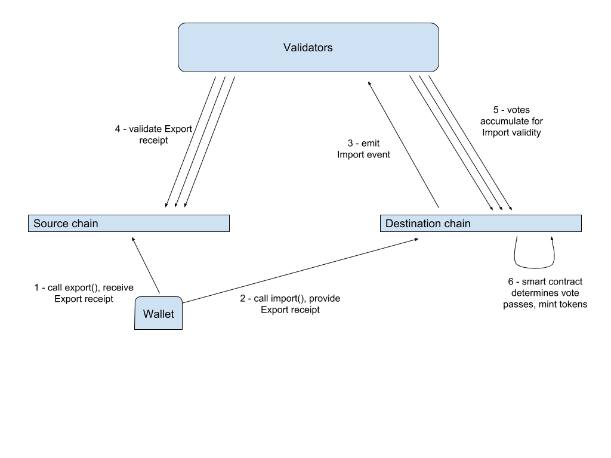
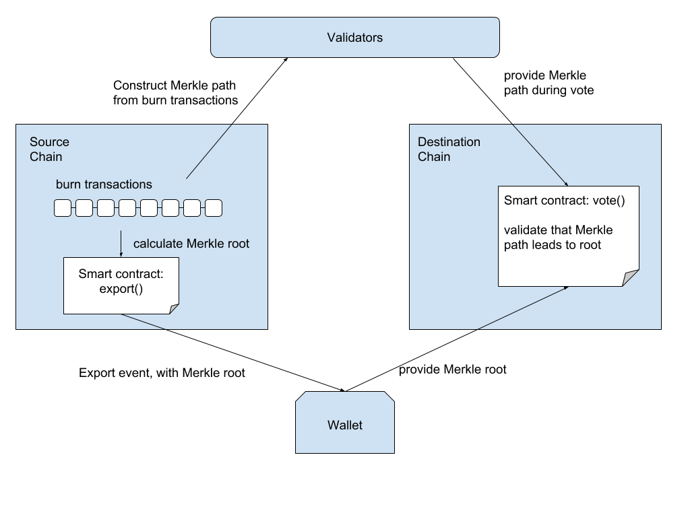

# Metronome Cross-chain Token Transfer
v0.91 (Last updated 06.13.2019)
## Introduction

One of the key features that helps ensure durability and resilience of Metronome tokens is the ability to move MET from one blockchain to another.  Unlike almost all other digital tokens, Metronome helps owners avoid risk by provably moving the same asset from blockchain A to blockchain B.  The process of moving Metronome tokens across blockchains is known as **import** and **export**, and this document provides engineers and the community with significant additional detail about this key feature.

The Metronome import and export algorithms enable transfer of MET tokens from one set of Metronome smart contracts to another set of Metronome smart contracts (usually) hosted on a different blockchain. Exporting from a contract provably removes the MET tokens from the origin-chain, and importing to a contract provably adds the MET tokens to the destination chain. The Metronome protocol ensures a single global money supply remains intact.

Below, we first introduce terminology used throughout this document. Next we set out our requirements and challenges involved. Finally, we discuss individual component designs the proposal for token transfer that offers good tradeoffs in terms of scalability, security, and decentralization.

This document, particularly surrounding phase 2 and 3 of validation, is a living, collaborative document. We encourage community members to read this documentation and provide feedback, suggestions, and edits in the form of GitHub issues.  The multi-phase validation plan follows the wider goal of Metronome, where this project aims to provide ever-increasing amounts of decentralization, and an overall sustainable autonomous economy.

## Definitions

A **Validator** is off-chain software running on distributed nodes, maintained by a publicly known entity, which exists in order to propagate an event from one blockchain to another. Validators are responsible for observing a blockchain for events, validating cross chain transactions (as described below), and voting on the validity of that event. Initially, there will be about n validators (with the goal of 5) but eventually we must allow any trusted entity to run a validator in order to encourage a more decentralized MET token transfer process, with the need for validators fading in subsequent phases. 

A **Source chain** is a blockchain running Metronome smart contracts from which a user wishes to transfer MET tokens. The target chain of the transfer is referred to as the **Destination chain**.

An **Export event** occurs on the Source chain when a user wishes to initiate a MET token transfer. It is equivalent to a burn event, where the desired number of tokens have been removed from that chain’s supply. Corresponding to each Export event is an **Import event** on the Destination chain where the same number of previously burned tokens are minted onto the destination chain.

Before emitting an Export event, the Source chain creates and stores the **burn transaction**, capturing all details of the burn, including the previous burn transaction. In this way, each chain maintains a list of all burn transactions that have originated from that chain, regardless of what their Destination chain will be. Also, each burn transaction hash depends on the previous burn transaction hash. By definition, the very first burn transaction on a given chain has no previous burn transaction, so uses the value of “0” for its hash.

A **Merkle tree** is built up by recursively hashing adjacent pairs of data from some given sequence. At the top of the tree is the **root hash**, which indirectly depends on every element in the tree. No data can be changed in the tree without affecting the **root hash**. An element can be proven to be in the tree by performing a **Merkle proof**, which consists of providing an element and its **Merkle path** to the root. The Metronome transfer strategy utilizes the creation of a Merkle tree from burn transactions.

A **lily pad** is an informal term for a single interconnected set of deployed Metronome smart contracts. It is a single data domain against which MET token import and export occurs. Because two lily pads may be deployed on the same blockchain, it is more technically accurate to refer to Metronome import/export as transferring MET between lily pads. Each lilypad contains and manages a separate ledger each keeping track of its share of the global MET supply. 

## Merkle Tree Construction and Path Verification

Let us show an example of building a Merkle tree from a list of eight values, numbered B1 to B8. First we hash each value individually, producing H1 to H8.

The tree is then built from the bottom up, where we progressively hash together adjacent elements to form parents in the tree that make up the higher levels.

Combining adjacent elements gives us half the number of values:
- H1..2 = hash(H1, H2)
- H3..4 = hash(H3, H4)
- H5..6 = hash(H5, H6)
- H7..8 = hash(H7, H8)

We next move up one level, again resulting in half the number of values:
- H1..4 = hash(H1..2, H3..4)
- H5..8 = hash(H5..6, H7..8)

And finally we produce the root of the Merkle tree:
- H1..8 = hash(H1..4, H5..8)

The true utility of a Merkle tree lies in the computationally efficient way of proving an element is in the tree.

Assume you are given the root of the tree, H1..8, as derived above. You can prove that some element, say B4, is in the tree by also providing what is referred to as the Merkle path. The path is made up of the siblings of the nodes reached while going up the tree to the root.

For the H4 element, the corresponding path would be: H3, H1..2, and H5..8.

The sequence of operations you would do to validate the path would be:
- H4 = hash(B4)
- H3..4 = hash(H3, H4)
- H1..4 = hash(H1..2, H3..4)
- H1..8 = hash(H1..4, H5..8)

The path is validated if the final hash value arrived from the path matches the H1..8 previously given.

Note that there are other implementation details, such as how to handle a number of blocks that are not a power of two or the specification of the ordering of the arguments to the hash function. These details are out of scope of this document.

## Requirements

The global supply of MET tokens must be limited and predictable at all times. The supply must never exceed the 10,000,000 initial supply plus the present sum of the daily minted tokens, which are minted as the greater of 2,880 tokens or the amount required to achieve an annual rate of 2% of the outstanding MET in circulation.

One of the original principles in blockchain design was to prevent double spending. Thus, during the process of transferring MET tokens from one chain to another, we must guard against a single Export resulting in multiple Imports. Conversely, if we design for the ability to cancel an Export event we must not allow an Export to be reversed and the corresponding Import to proceed.

We must also design how to handle blockchain forks, as this could lead to an artificial increase in the global supply and/or double spending.

As we wish to grow the already functional Metronome ecosystem, we will need the ability to onboard new blockchains. This in turn will require us to onboard new validators.

In the early phases (phase 1 especially), we use the ability to remove validators and chains from the system. Like other multi-signature/multi-party signing systems, cases such as validator retirement and key revocation must be handled. There are also cases where -- most notably in phase 1 -- where a chain may be removed, when a chain may unexpectedly start violating the Metronome protocol (ie. bitcoin-like consensus behavior),  or a chain becomes not economically worth validating (blockchain tx fees skyrocket to the point of economic unsustainability).

Our last requirement is perhaps the most important: Transfers must be cryptographically provable and transparent.

For completeness, we will mention a few issues that we are not setting out to solve. There is no restriction that both the source and destination address used in a transfer belong to the same user, thus we allow transfers to any address on the Destination chain. This creates a common network carrier style policy that aims to be content and address neutral. There is no restriction that Import events are processed or accepted in the same order as the corresponding Export events.

## Three Phase Approach

In order to ensure security and usability of Metronome’s cross-chain features, there will be three phases of cross chain rollout. Each subsequent phase will further decentralize the process for completing cross-chain moves. 

**Phase 1** - Federated Network of Validators

In phase 1, a small, federated network of validators operates in a multi-signature, multi-party approach to validate import/export transactions follow the Metronome protocol. MET owners may export at any time. On the import side, a quorum of validators approves a set of import transactions submitted by users. A quorum of validators will add and remove Metronome-available chains and other validators. The goal of Phase 1 quorum is to have 5 validators at the launch of the 2nd Metronome chain (and thus, the launch of the first Metronome import/export).

In the event of a chain fork, the quorum of validators will choose which side of a fork is The Real Metronome.

**Phase 2** - Chain Attestors and stake weighting

Phase 2 seeks to decentralize and move away from validators. For each blockchain, Metronome will look to *chain oracles* that provide a very specific piece of data: What is the Official Timeline for a particular currency?

Take for example Ethereum (ETH) chain. In the event of an Ethereum hard fork, the Metronome system would look to *ethereum community* oracles to answer the question of Latest Block Hash. The Metronome system, on Ethereum, would automatically follow the side of a hard fork that the Ethereum community follows.

This system is replicated for each blockchain supported, such as Ethereum Classic (ETC), Qtum and Rootstock on Bitcoin (RSK/BTC). ETC would have its own, independent set of *community oracles* that answer the question of Latest Block Hash. In the event of an ETC fork, the Metronome system would use the ETC community oracles as the source of truth.

The goal is the *automate* the choosing of hard fork sides, automatically ingesting and following the community choice for each blockchain.

Finally, as a global check on shenanigans via minority chains and attack-style hard forks, the percentage of total Metronome tokens on a particular chain shall have that level of percentage global weight, in the event of a discrepancy in the Metronome consensus protocol between two versions of the MET global supply timeline. 

**Phase 3** - Fully autonomous, stake-weighted cross chain transfers

Phase 3 of cross-chain validation provides a fully decentralized end state. The model mirrors that of the original Bitcoin blockchain, a full consensus protocol.   This model includes
1. A **node**. In MET phase 3, each lily pad may be considered like a single Bitcoin node.
2. A **blockchain**. In MET phase 3, each lily pad maintains its own independent copy of the history of all MET cross-chain transfers.
3. A **transaction**. In MET phase 3, each user-generated import may be considered like a single unconfirmed Bitcoin transaction. An import is considered confirmed after 24 blocks (24 hours).
4. A **block**. In MET phase 3, a block may be generated once per hour, on a stake-weighted basis (total stake weight of entire lily pad).  This block is shared by users desiring imports to each lily pad.
5. **Consensus protocol** is Bitcoin design, with proof-of-stake modification. We call this **APS**, Autonomous Proof of Stake, because it is different from both POS and DPOS. In MET phase 3, each lily pad is a stake-weighted autonomous actor.

This is possibly the first *cross-blockchain blockchain*.  Each lily pad -- each set of smart contracts -- uses a Bitcoin-style consensus protocol, with Proof-of-Stake modification to determine the outcome of hard forks. This consensus protocol *automatically* chooses one side of a hard fork over another. 

## Challenges

### Forking

Forks may occur under different circumstances. Temporary forks occur frequently when multiple nodes mine the next block, though these forks are quickly resolved as the longest chain amongst peers wins. By requiring that the validators not react to an Export event until it is at some minimal block height, which may vary across chains, the chance of a validator voting on and propagating a soon to be abandoned block should be minimal. For instance, on Ethereum community members suggest a minimal block height of anywhere between 5 and 500 based on the desired level of security (https://ethereum.stackexchange.com/questions/319/what-number-of-confirmations-is-considered-secure-in-ethereum).

A contentious hard fork, on the other hand, occurs when some portion of the community has decided to diverge the blockchain client and essentially create a new, independent chain. The resolution of a contentious hard fork will require human intervention. It must be decided by the Metronome system and/or community which fork will be kept.

As noted above, there will be three phases of the validator network – going from a compromise, federated model to increasingly decentralized with each additional phase. These phases govern how to handle things like chain addition, removal, and fork choices. 

**Phase 1** - Federated Network of Validators

In phase 1, the federated validator network will consider the technical, security, and community characteristics of both sides of the contentious fork. Following deliberation of these considerations, a quorum of validators will eventually “bless” one chain to be viewed as valid by the Metronome network. 

**Phase 2** - Chain Attestors

Phase 2 forked chain election will utilize the knowledge and community sentiment of their specific chain. For example, suppose that chain A is forking. Chain A’s foundation, or other consortium of developers, merchants, and other community members will choose which side the Real Ethereum or the Real Ethereum Classic etc.  The Metronome system will follow that choice.  New forks do not create new airdrops of MET tokens. 

**Phase 3** - Stake-weighted Blockchain of Blockchains

Phase 3 of cross-chain validation will use a blockchain of blockchains, described above, to validate headers, but will choose the side of a contentious fork based off the weight of that particular chain(s)’s portion of the global Metronome supply. The side with more of that supply will become the valid chain. 

Once consensus is achieved, only one fork -- and the MET therein -- would be made valid in the Metronome ecosystem via the validation process as described (since this new fork is effectively a new chain, see the “Adding and Removing Chains” section). This blocks any further transfer of MET tokens to or from the new chain, as those tokens on the losing side of the fork are no longer Metronome. 

If the Metronome community later decides to support this newly forked chain, it would be onboarded just as any new lily pad would be. A new set of Metronome contracts would be deployed, which would not share any history with the previously deployed contracts on that chain.

### Validator Front-running

It is possible that a miner can observe pending transactions, and act in the market with that knowledge.  It is possible that miners may block certain cross-chain transactions for a specific blockchain.

In phase 1, validators introduce similar risks.  validators see import/export transactions immediately, and may act on that knowledge in the market, or on the transaction stream.  The quorum system is the defense against individual malfunction or malfeasance.  In later phases, validators are removed from the transaction stream, replaced by chain-tip oracles.

In either case, front running is possible (inserting one’s own transaction before one provided to you by an external party).

### Canceling a Transfer

To ensure a robust system, additional sets of Metronome smart contracts may support the canceling of a transfer. At this point there is no plan to develop this feature.

An outline of how Metronome could support this would first involve canceling a pending Import event (before it has been fully validated and before tokens on the Destination chain have been minted). This cancellation would be observed by the validators, and they would propagate this event back to the Source chain where tokens would be re-minted.

### Validator Scalability

Validators can scale as the number of chains grows.

Given a set of n chains, there are n*(n-1)/2possible edges where we would want to support a transfer. 

## System Components and Design

Below we outline a design for a  cross-chain transfer of Metronome tokens. We then supply various implementation details that show how the requirements are met for such a transfer.

### Token Transfer Overview

The diagram below illustrates the steps taken that result in a transfer of Metronome tokens from a Source chain to a Destination chian.

The user, utilizing a Wallet, initiates the transfer by exporting tokens from the Source chain, which results in those tokens being burned.

An Export receipt is then provided to the Destination chain, which contains various parameters of the export as well as a Merkle root hash calculated from Source chain burn transactions (regardless of Destination chain). At this point an Import event is emitted from the Destination chain.

Validators observe these Import events from the Destination Chain and verify the transaction against the Source chain. This involves verifying that the Export receipt exists in the specified block of the Source chain, validating existence of that event in the block’s Merkle tree.

Next the validators contest to the validity of an Import event by voting on the Destination chain. The validator supplies a Merkle path when voting, allowing for the Destination chain smart contract to verify that the path is in the root. This only requires that the Destination chain store the Merkle root, and not the entire tree or path.

Validators receive a small fee in compensation for performing their validation service.  This introduces some additional collusion risk in phase 1.

Once the Destination chain smart contract has received sufficient positive votes for an Import, the appropriate number of tokens are minted and the Import is deemed complete. 

The MET owner exporting to a new chain has to pay a small export fee.  The export fee will be paid in MET and this will be calculated either percent of export amount or minimum flat export fee whichever is higher.  After validations, this fee will be equally distributed among all validators at destination chain.  Fee percentage and minimum fee will be defined in Metronome contracts. 

### Event Emission

The validators must not act on an emitted Import event until it has a block height of at least 4000-5000 (meaning that 4000-5000 blocks have been mined beyond the block containing the transaction with the given event). This is to avoid forking and mitigate the effects of 51% attacks.

### Maintaining Global MET Supply

Maintaining the global supply of MET tokens requires that each chain have enough internal knowledge to independently determine what portion of the global supply is currently on its chain. At the time of each daily minting (midnight UTC for every MET deployment), the smart contract is able to calculate the expected global supply by using the genesis time of the very first Metronome smart contracts that were deployed onto the Ethereum network (this value will be hardcoded into the smart contract as a constant). The smart contract also knows what supply of MET are on its chain, and thus is able to calculate the portion of global MET on this chain.

Since a MET token transfer between chains is not an atomic operation, there can be timing issues of the Export and Import events that affect the daily minting calculations. The simplest case is when both the Export and Import events are completed on the same day. The Source chain would have atomically burned the tokens and the Destination chain would have minted the same number of tokens. The global supply remains constant, and each chain knows its appropriate share.

An issue does arise if the Export event occurs shortly before midnight UTC (the daily minting time), but the Import event does not complete until some time after midnight. The Source chain will have burned the tokens and at midnight minted a proportionally smaller number of tokens. Since the Import event has not yet completed on the Destination chain, the daily minting calculation on that chain will not include these tokens. This is an improbable edge case, but needs mentioning.

This situation is detectable by the Destination chain smart contract since contained in the burn receipt is the burn time of the tokens. The contract can calculate whether that time occurred on a previous day. It still remains to be determined if we would mint some appropriate number of tokens at that point, or save this calculation for the next daily minting.

It should be noted that chains should not simply include pending Import events when calculating their total supply, as this would allow users to submit invalid Import events and artificially raise the expected token supply on that chain.

If we do not correct for this potential undersupply of Metronome tokens, the issue will compound over time and the difference between the theoretical global supply and the actual global supply will increase.

We can call the state of MET tokens that are exported from the source lily pad, but not yet imported into the destination lily pad, **limbo**.  We can see that a certain amount of tokens will be in limbo at any given time, and a subset of these will never be imported into the destination chain (lost/destroy/vaulted forever).

### Smart Contract Voting

During Phase 1, each deployed set of Metronome smart contracts has methods whereby the Owner of the contracts can add or remove validators (essentially maintaining a whitelist) and set the number of successful votes that is required for an Import event to be accepted.

A vote can either be positive or negative. If the validator believes an Export event is valid it casts a positive vote, otherwise it casts a negative vote.

For either kind of vote to be accepted, the hash of the burn transaction must be signed by the validator. Each validator’s public key [hash] will be stored on chain such that the smart contract can verify a signed vote.

The acceptance of a positive vote from a validator also requires a successful Merkle proof. The Wallet provides the Destination chain smart contract with a Merkle root. This root is calculated from burn transactions on the Source chain. The general flow is diagrammed below.

Either the Source chain smart contract or the Wallet is responsible for calculating the Merkle root . The diagram above shows the smart contract calculating the root. The trade off here is the high gas cost of having the smart contract calculate the root versus the Wallet having to read enough burn transaction from the Source chain to calculate the root, essentially complicating the Wallet.

The number of leaves to include in the Merkle tree is limited to 16 in order to prevent the tree from growing unbounded. This will limit the Merkle path length to a value of log2(16)=4. In the case where there are fewer than 16 burn transactions, all of them should be used in calculating the Merkle root.

The validator calculates the Merkle path, having access to Export events from the Source chain, and provides this path to the Destination chain smart contract upon voting.

To accept a positive vote, the Destination chain smart contract must verify that:
- The validator address is whitelisted
- The recovered address from the signature matches the validator’s public address
- The validator has not yet voted for this Import event
- The merkle path provided by the validator leads to the Merkle root previously set by the Wallet

The same steps are followed to accept a negative vote except the last one, verifying a Merkle proof.

If a vote passes, which is saying the minimum number of validators have cast a positive vote, the Destination chain smart contract will:
- Pay the validator fees (described in more detail below)
- Mint MET tokens
- Set a flag (or some equivalent construct) to prevent further voting on this Import event

If a vote fails, which is saying the minimum number of validators have cast a negative vote, the Destination chain smart contract will:
- Pay the validator fees (described in more detail below)
- Set a flag (or some equivalent construct) to prevent further voting on this Import event

### Adding or Removing Validators

The Metronome smart contracts must be supplied with a list of known validators from which to accept votes. At launch of the validator network, there will be around n validators. The owner of the Metronome smart contracts will have the right to add or remove individual validator addresses. The contract owner only exists for phase 1, phase 2 and beyond no longer require contract owners. The contract owner from Phase 1 will be reassigned to the contract itself.

The contracts must also be supplied with the minimum number of positive votes that are acceptable for an Import event to succeed. Only the Phase 1 owner of the contracts will be able to change this value.

Eventually, as we move towards a more open and decentralized strategy for validators, it may not be feasible to update every blockchain with every known validator. Chains will independently determine if a validator has sufficient reputation to cast votes.

**Phase 1** - Federated Network of Validators

The owner address of the Metronome contracts on a chain will be able to add or remove validators in the Metronome ecosystem. This is only done if a quorum of validators approves the additional or removal or key rotation.

**Phase 2** - Chain Attestors

Chain-specific oracles manage themselves in a community-defined manner.  ETC oracles may be managed differently from EOS oracles, managed differently from ETH oracles.

**Phase 3** - No Attestors or Validators

Phase 3 will use a stake weighted system for chain addition, removal, and fork election. There are no attestors or validators to add or remove. 

### Adding and Removing Chains

Adding a chain equates to deploying the Metronome smart contracts onto another blockchain, and informing the other blockchains and validators of its existence.

Each chain is assigned some integer identifier, as determined by the owner of the Metronome smart contracts. This value, call it the chain-identifier, must be provided to every previously deployed Metronome smart contract as well as to any validators that will be communicating with this new chain.

**Phase 1** - Federated Network of Validators

In phase 1, the trusted validator network will consider the technical, security, and community characteristics of new chains and contracts. The contract owner will then add new chains in the contracts  based on a quorum of validator approval. 

**Phase 2** - Chain Attestors

In Phase 2, anyone can add a new contract set to the Metronome ecosystem, but will need to identify the chain attestor associated with that new set of contracts. For example, if someone added a set of Metronome contracts to chain A, they likely would have chain A’s foundation as the chain attestor – as it can be assumed that chain A’s foundation would act in the best interests of chain A. 

Once added, the wider Metronome community would decide if this addition is valid or invalid based on a stake-weighted mechanism. 

**Phase 3** - Stake Weighted Blockchain of Blockchains

Phase 3 will not have chain attestors, even at contract deployment. Instead, anyone can launch a new set of contracts and the community would then determine if the contracts added are valid or invalid via the aforementioned stake-weighted consensus mechanism. 

The newly deployed Metronome smart contracts must be supplied with:
- The chain-identifier assigned to this chain.
- Identifiers of all other existing chains with a Metronome deployment, along with the addresses of these other contracts.
- A timestamp value from the genesis Metronome smart contract, in order to calculate the expected daily total supply (see section on maintaining global MET supply).

These identifiers are distributed as a simple precaution and to provide sanity checking. For instance, a request to generate an Export event will ensure that the Destination chain identifier supplied is known. Conversely, an Import will only be accepted if the Destination chain identifier is the same as that chain’s identifier. This additional level of checking comes at the cost of maintaining and distributing this information to all chains where Metronome is deployed.

In order to support removal of a chain, the reverse of the above actions would be taken.

### Fees

In order to reward and incentivize validators, and also to establish a system that will allow for more decentralized validators in the future, the Metronome smart contracts support payment of fees to process transfers. Validators will set their own fees. This fee is later distributed to the validators after a vote is accepted or rejected. If an event is accepted, the fee is only paid to those validators that cast a positive vote. Conversely, if an event is rejected, only validators that cast a negative vote will receive the fee. Phase 2 will have attestors set their fees, and phase 3 will not have attestors or validators, meaning the only fees will be those associated with the underlying network.

The Wallet, and thus the end user, pays the gas cost during the import or claim call on the Destination chain plus some minimum fee in the native currency of that chain. The user has the option of paying more than the minimum to encourage validators to race to process the transfer.

The fee is collected in MET, and is determined as the higher of 0.001 MET or 0.5% of the MET to be transferred. The fees are evenly distributed amongst the validators.

This fee structure is specific to phase 1, and will be phased out in future phases.

## Conclusion

Several designs were considered in the process of formalizing the current solution to support Metronome token transfer between different blockchains. The current design provides a good balance between the trade-offs involved. All Wallet interactions happen early in the transfer and we get the benefits of auto-minting of the tokens on the Destination chain.

### Further Analysis Needed

More analysis should be done on the fee payment proposed here, with an eye towards modeling the expected behavior of validators. This may not be necessary at first, since validators will be trusted entities, but will become necessary when validators become more decentralized.

We should specify an approach for the validators to sign the Export event and for the Destination chain smart contract to verify their signature.

More thought needs to be put into the design for validators to add themselves in a more decentralized way. We imagine a system on chain that maintains reputation of some sort. Validators would self-register and begin voting, although their votes would not be counted until they have built up a reputation. Reputation could be gained by casting successful votes in a timely manner. When voting, Validators could stake tokens or some native currency. Considering the novelty of the voting design outlined here, the smart contracts that handle voting should be designed such that they are later upgradeable.

There may still be some unsolved issues with handling contentious hard forks. For instance, the global supply limit may be broken if a user successfully transfers MET from a fork before the Metronome community has had a chance to remove that fork from the list of valid chains.

Some thought should be put into a way to support canceling an Export. This could happen by canceling the pending Import on the Destination chain, and effectively following the same validator flow in the other direction. Validators verify a canceled pending Import event, and vote on reverting the original Export event on the Source chain.
